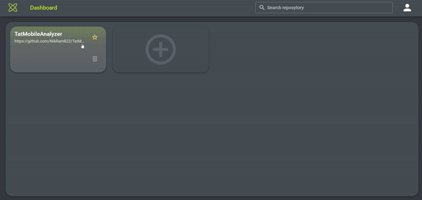

# TatMobileAnalyzer


## What is TatMobileAnalyzer?

TatMobileAnalyzer is a comprehensive solution for analyzing developers' work and estimating project labor costs. This solution is designed primarily for senior managers and product owners and is a tool that provides statistics on project participants as well as the COCOMO2 project estimation model
For more information visit our [Software Requirement Specification document](docs/SPECIFICATION.md).

## Functions represented in our system

<details>
<summary>Click to see more</summary>

The following features are currently available:

### Analyzing developer contributions to the project:

Analyze all commits by project contributors. Based on the analyzed commits, an objective picture of the repository for the selected period for each contributor is obtained. There is information about who wrote how many lines, how many lines got into the repository, how many lines are not used in the repository and what percentage of useful lines the contributor writes.


### Calculating the cost of a project based on COCOMO 2:

The project provides the ability to estimate project labor costs based on the COCOMO 2 model. This model allows you to estimate the planned cost of the project, the planned effort, the timeframe and the number of developers.
</details>



## Build

### with Docker

Below are the instructions for running `docker-compose`:

1. Ensure that you have Docker and `docker-compose` installed on your system.

2. Go to `/src/main/resources` and create `env.properties` file with next content:

   ```text
   ACCESS_TOKEN_GITHUB=your_github_access_token
   ACCESS_TOKEN_GITLAB=your_gitlab_access_token
   DB_USER=some_user
   DB_PASSWORD=some_password
   DB_DATABASE=some_database
   DB_URL=jdbc:postgresql://postgres_db:5432/some_database
   FRONTEND_HOST=https://host.com/
   ```

   - Replace all parameters to your parameters

3. Go to `./tat-mobile-front` and create `.env` file with desired backend URL localhost for dev and real one for hosted backend:

   ```text
   VITE_BACKEND_URL=http://localhost:8080
   ```

4. Run Docker Compose:

   - in the root folder run `docker-compose up -d` which will build and run your containers in detached mode.

5. Verify:
   - Check if your services are up and running `docker-compose ps`
   - Access your application via the specified port (e.g., http://localhost:8080/swagger-ui.html for backend,
     and http://localhost:3000/ for frontend).

### without Docker, locally

<details>
<summary>Click to see more</summary>

1. Ensure that you have `jdk-17` with `maven` for building projects, `npm` and
   latest `postgres` database installed on your system.
2. Create two `env.properties` files:
   - In the root folder create `env.properties` file with next content:
   ```text
   ACCESS_TOKEN_GITHUB=your_github_access_token
   ACCESS_TOKEN_GITLAB=your_gitlab_access_token
   DB_USER=some_user
   DB_PASSWORD=some_password
   DB_DATABASE=some_database
   DB_URL=jdbc:postgresql://localhost:5432/some_database
   FRONTEND_HOST=http://localhost:3000/
   ```
   - Replace `<your_github_access_token>`\ `<your_gitlab_access_token>` to your github\gitlab access token. `DB_USER`, `DB_PASSWORD`,
     `DB_DATABASE`, and `DB_URL` should be real one and relevant for your `postgres` database.
     Note! The database should be created before running the backend. `FRONTEND_HOST` should be replaced with the address of your frontend.
   - Go to `./tat-mobile-front` and create `.env` file with next content:
   ```text
   VUE_APP_HOST_ADDRESS=http://localhost:8080/patch/statistic
   ```
3. Build jar file `mvn clean package`. The builder will generate jar file in target directory:
   `target/TatMobileAnalyzer-0.0.1-SNAPSHOT.jar`
4. Go to target `cd target` and run backend `java -jar TatMobileAnalyzer-0.0.1-SNAPSHOT.jar`.
5. The backend will be available by this link `http://localhost:8080/swagger-ui.html`.
6. Run `cd tat-mobile-front && npm install`. It will download all dependencies.
7. Start frontend `npm run dev`. The website will be available by this link `http://localhost:3000`.
</details>

## Other

### TatMobileAnalyzer uses

1. Java (version 17)
2. Js
3. Spring boot (version 2.7.4)
4. Vue.js (version 3.4.21)
5. PostgreSQL
6. Swagger2 (version 2.7.0)
7. Javadoc (version 3.0.0)

### Links

- [TatMobile Analyzer](http://178.154.240.54:3000/)
- [Tat Mobile Specification](docs/SPECIFICATION.md)
- [GitHub Workflow Rules](docs/WORKFLOW.md)
- [Figma Prototype](https://www.figma.com/file/OE0pQL3mn4wlcng6o10AK3/ServiceDesign?type=design&node-id=264%3A1251&mode=design&t=XG83iR2C8fcI6gXF-1)
- [Other Artifacts](https://drive.google.com/drive/folders/1RKxz5tozCQmqkwWamR1bCjz847XtSwqx?usp=sharing)

### License

The project is licensed under the [LICENCE](https://github.com/NikRam822/TatMobileAnalyzer/blob/master/LICENCE)
