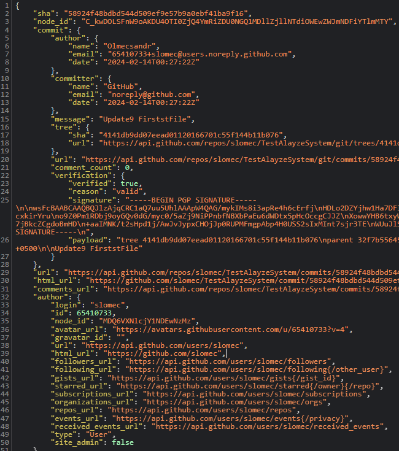
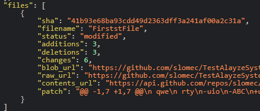
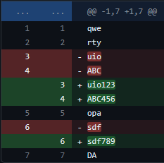

## Research on GitHub API: Получение полной информации по коммиту, включая внесенные изменения

### 1. Получение информации о коммитах в репозитории

Original Docs GitHub API: [REST API endpoints for commits - GitHub
Docs](https://docs.github.com/en/rest/commits/commits?apiVersion=2022-11-28)

Для этого нужно обратиться к GitHub API используя данную
[ссылку:](https://api.github.com/repos/slomec/TestAlayzeSystem/commits)

```angular2html
https://api.github.com/repos/OWNER/REPO/commits
```
* OWNER - имя владельца репозитория
* REPO - название репозитория
* Для закрытого репозитория так же нужно использовать токен.

Для получения коммитов в определенном промежутке времени используются
параметры: *since - после* и *until - до, указав для них время в
формате* ISO-8601

[Пример](https://api.github.com/repos/slomec/TestAlayzeSystem/commits?until=2024-02-14T00:31:44Z&since=2024-02-14T00:11:54Z):
```angular2html
https://api.github.com/repos/OWNER/REPO/commits?until=2024-02-14T00:31:44Z&since=2024-02-14T00:11:54Z
```

В полученном объекте будет вся информация по коммитам (в том числе и
SHA) за исключением конкретных изменений в файлах в коммите.

Для получения этой информации нужно обратиться к конкретному коммиту,
указав в ссылке так же SHA коммита.

[Пример](https://api.github.com/repos/slomec/TestAlayzeSystem/commits/58924f48bdbd544d509ef9e57b9a0ebf41ba9f16):
```
https://api.github.com/repos/slomec/TestAlayzeSystem/commits/58924f48bdbd544d509ef9e57b9a0ebf41ba9f16
```

Мы получим объект с дополнительной информацией остальная информация
будет идентична тому что присутствовало в предыдущем объекте.

### Примечание!

GitHub API имеет ограничение по количеству запросов!

Ограничение первичной скорости для **неаутентифицированных**
пользователей:

Неаутентифицированные запросы получают только public информацию и
ассоциируются с IP-адресом отправителя, а не с пользователем или
приложением, сделавшим запрос. Поэтому обойти легким путём ограничение
не получится.

Первичное ограничение скорости для неаутентифицированных запросов
составляет 60 запросов в час.

Ограничение первичной скорости для **аутентифицированных**
пользователей:

Для выполнения запросов к API можно использовать персональный токен
доступа. Кроме того, вы можете авторизовать приложение GitHub App или
приложение OAuth, которое сможет выполнять API-запросы от вашего имени.

Все эти запросы засчитываются в ваш персональный лимит в 5 000 запросов
в час. Запросы, выполняемые от вашего имени приложением GitHub, которое
принадлежит организации GitHub Enterprise Cloud, имеют более высокий
лимит скорости - 15 000 запросов в час. Аналогично, запросы, сделанные
от вашего имени приложением OAuth, которое принадлежит или одобрено
организацией GitHub Enterprise Cloud, имеют более высокий лимит скорости
в 15 000 запросов в час, если вы являетесь членом организации GitHub
Enterprise Cloud.

### 2. Содержание Объекта с информацией о коммите



#### Самое важное:

(далее, цифра - номер строки)

2 sha - sha коммита

6 name - никнейм автора коммита

8 & 13 date - дата коммита

29 url ссылка на этот коммит в GitHubAPI.

33 login - логин автора

#### В самом низу под значением files указана подробная информация об изменениях.



filename - имя измененного файла

status - Может быть modified или added, что означает создан был файл или
изменен

additions - кол-во добавлений строк

deletions - кол-во удалений

changes - общее кол-во изменений (additions + deletions)

### 3. Свойство (ключ) "patch"

Значением ключа patch являются подробные изменения. Там указаны данные
которые могут служить например для представления как в GitHub:



```angular2html
*\"patch\": \"@@ -1,7 +1,7 @@\\n qwe\\n
rty\\n-uio\\n-ABC\\n+uio123\\n+ABC456\\n opa\\n-sdf\\n+sdf789\\n DA\"*
```

В начале между @@ указан диапазон строк в которых было изменение.

Со знаком минус указаны удаленные с плюсом добавленные

В диапазон также включены предыдущие три строки в которых нет изменений
и три последующие, поэтому здесь присутствуют строки 1,2,7.

Далее перечислены строки и операции над ними:

\\n строка осталась без изменений

\\n- строка была удалена

\\n+ Строка была добавлена

### 4. Ссылка на тестовый репозиторий:

Этот репозиторий можно использовать для экспериментов и тестирования
GitHub Api:
[https://github.com/slomec/TestAlayzeSystem](https://github.com/slomec/TestAlayzeSystem)

Для получения доступа в репозиторий обращаться к Александру.
Телеграм алиас: @Alexandr_83836
