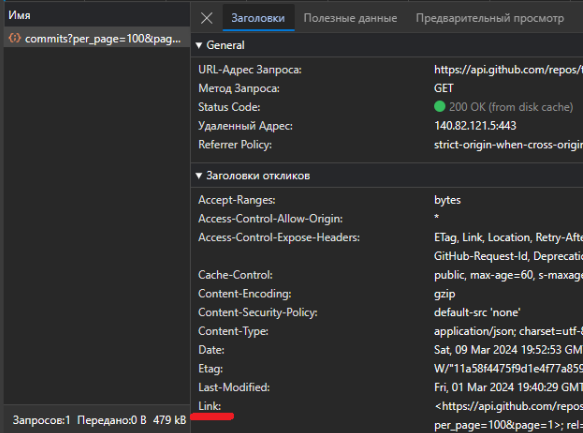

## Research on GitHub API: Разбиение на страницы или пагинация в гит ипп

Original Docs GitHub API: [Using pagination in the REST API - GitHub Docs](https://docs.github.com/en/rest/using-the-rest-api/using-pagination-in-the-rest-api?apiVersion=2022-11-28)

Предыдущий ресерч по теме получения коммитов репозитория: [Research on GitHub API: Получение полной информации по коммиту, включая внесенные изменения](./GITHUB_API_1.md)

### 1. Изменение размера страницы

При произведении request’а через GitHubAPI для получения информации по коммитам с объемных репозиториев, полной информации в одном respons’e не будет - REST API имеет ограничение на количество коммитов на одной странице:

По умолчанию это 30 коммитов, максимум 100.

Для указания количества объектов используется **параметр**: _per_page_.

В этом запросе мы получим 100 коммитов (максимально возможное количество):

[**Пример:**](https://api.github.com/repos/torvalds/linux/commits?per_page=100)

```
https://api.github.com/repos/OWNER/REPO/commits?per_page=100
```
* OWNER - имя владельца репозитория
* REPO - название репозитория
* Для закрытого репозитория так же нужно использовать токен.

### 2. Переключение между страницами

Чтобы выбрать страницу которую мы хотим открыть, используется **параметр:** page

Например: [api.github.com/repos/torvalds/linux/commits?page=3](https://api.github.com/repos/torvalds/linux/commits?page=3)

```
https://api.github.com/repos/torvalds/linux/commits?page=3
```

Или: [api.github.com/repos/torvalds/linux/commits?per_page=40&page=34](http://api.github.com/repos/torvalds/linux/commits?per_page=40&page=34)

```
http://api.github.com/repos/torvalds/linux/commits?per_page=40&page=34
```

### 3. HTML заголовок link для перемещения между страницами

HTML заголовок link - это то что мы будем использовать для перехода на следующую страницу.

Сразу рассмотрим пример:

Вот запрос на третью страницу: [api.github.com/repos/torvalds/linux/commits?per_page=100&page=3](https://api.github.com/repos/torvalds/linux/commits?per_page=100&page=3)

```angular2html
https://api.github.com/repos/torvalds/linux/commits?per_page=100&page=3
```

при его выполнении помимо response body с html страницей или json, мы получим response headers (заголовки), один из них link.

Его можно найти открыв панель разработчика в браузере, во вкладке `сеть > адрес запроса > заголовки`



Он содержит ссылки:
* На следующую страницу: rel="next"
* На последнюю страницу: rel="last" (в этой ссылке есть информация о общем количестве страниц page=12513)
* На первую страницу: rel="first"
* На предыдущую страницу: rel="prev"

```angular2html
https://api.github.com/repositories/2325298/commits?per_page=100&page=4; rel="next"
https://api.github.com/repositories/2325298/commits?per_page=100&page=12513; rel="last"
https://api.github.com/repositories/2325298/commits?per_page=100&page=1; rel="first"
https://api.github.com/repositories/2325298/commits?per_page=100&page=2; rel="prev"
```


В запросе [api.github.com/repos/torvalds/linux/commits?per_page=100](https://api.github.com/repos/torvalds/linux/commits?per_page=100) на первую страницу мы получим две ссылки next и last:

```angular2html
https://api.github.com/repositories/2325298/commits?per_page=100&page=2; rel="next"
https://api.github.com/repositories/2325298/commits?per_page=100&page=12513; rel="last"
```

В запросе [api.github.com/repos/torvalds/linux/commits?per_page=100&page=12513](https://api.github.com/repos/torvalds/linux/commits?per_page=100&page=12513) на последнюю страницу мы получим две ссылки first и prev:

```angular2html
https://api.github.com/repositories/2325298/commits?per_page=100&page=1; rel="first"
https://api.github.com/repositories/2325298/commits?per_page=100&page=12512; rel="prev"
```
