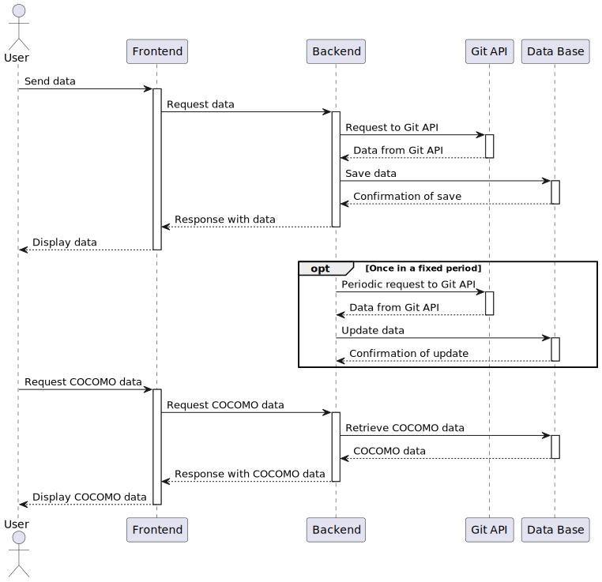

# TatMobile Software Requirements Specification Doc

## Authors:

- Amir Khuzin: a.khuzin@innopolis.university
- Timur Akhmatov: t.akhmatov@innopolis.university
- Nikita Ramzin: n.ramzin@innopolis.university

## Table of contents

1. [Introduction](#introduction)
   - [Agreements](#agreements)
   - [Project Description](#project-description)
   - [Links](#links)
2. [Project Overview](#description)
   - [Stakeholders](#stakeholders)
   - [Decision Analysis](#solution-analysis)
   - [Metrics](#metrics)
3. [Requirements](#requirements)
   - [User Stories & Interview](#user-stories)
   - [Use Cases](#use-cases)
   - [Quality Attributes](#quality-attributes)
4. [Architectural_Views](#architectural-views)
   - [Static](#static-perspective)
   - [Dynamic](#dynamic-perspective)
   - [Use-case diagram:](#use-case-diagram)
   - [Entity relationship diagram](#entity-relationship-diagram)
5. [Researches](#researches)

## Introduction 

The purpose of this document is to provide a comprehensive overview of the requirements for the
development of a tool for estimating developer contributions to a project, as well as estimating project labor costs. It serves as a guide for
stakeholders, developers, and project teams involved in the design, development, and implementation phases.
design, development, and implementation. The SRS describes the functional and
non-functional requirements that define the expected behavior and performance of the
of the system.

### Agreements 

The following conventions are used throughout this document:

- **Bold** text: represents section headings and important keywords.
- **Cursive**: Denotes variables, placeholders, or user input.
- Monospaced text: refers to code snippets, file names, and technical
  terms.
- [External Link]: links to external documents or resources.

### Project Description 

The Developer Contribution Assessment Tool is designed to analyze repositories of
software repositories and provide metrics for evaluating developer contributions to a specific project.
specific project. This tool will help stakeholders make
informed decisions related to resource allocation, project management, and performance evaluation.

The tool includes 2 key functionalities:

- **Analyze Developer Contributions.**

This functionality uses Churn metrics.
The system analyzes commits for a specified period, analyzes files in commits and changes in these files.
Thus the system collects data about who wrote how much code and displays it in the form of a graph.

- **Labor intensity estimation according to COCOMO-2 methodology.**

This functionality is a tool for estimating a project based on the number of lines of code, type of room and additional coefficients.
The user can specify all necessary data about the analyzed project and get the planned project cost.

### Links 

This document refers to the following documents, prototypes, and resources:

- [TatMobileAnalyzer repository](https://github.com/NikRam822/TatMobileAnalyzer)
- [Figma Prototype](https://www.figma.com/file/OE0pQL3mn4wlcng6o10AK3/ServiceDesign?type=design&node-id=264%3A1251&mode=design&t=XG83iR2C8fcI6gXF-1)
- [Role Table](https://docs.google.com/spreadsheets/d/1XhRbq4rEerV7g63WXSJjuF9qFM0C1nxG2EsSbE144wI/edit?usp=sharing)
- [Other Artifacts](https://drive.google.com/drive/folders/1RKxz5tozCQmqkwWamR1bCjz847XtSwqx?usp=sharing)

## Project Overview 

### Stakeholders 

Below are some potential stakeholders and their interests in
regarding your developer contribution assessment tool:

1. Project Managers:
   They are interested in understanding the overall performance and contribution of developers to the project.
   Metrics such as commit frequency, code changes, and developer rating will be helpful to
   them useful for project management and resource allocation.
2. business analysts:
   Business analysts may be interested in the tool's ability to provide
   insight into the efficiency of the development process. They could use this
   data to identify areas of improvement and make informed decisions
   regarding project strategies.
3. Development Team Leaders (TechLeads):
   Team leaders want to assess the individual and collective performance of the members of
   of their team members. They would be interested in detailed metrics on code quality, collaboration, and
   any signs of potential problems such as code duplication or cheating.
4. Developers:
   Developers themselves would be interested in how their contributions are measured. Honest and accurate
   representation of their work, recognition of their efforts, and a tool that promotes healthy
   competition and collaboration will be key developer interests.
5. Quality Assurance (QA) Team:
   QA teams may be interested in metrics related to the quality of the
   code, testing, and how changes made by developers affect the overall
   stability of the project.
6. Company executives or management:
   Company executives may be interested in the tool's ability to measure the
   productivity and efficiency of the development team, ensuring efficient
   utilization of company resources.
7. Human Resources (HR):
   The human resources department can use this tool to evaluate the effectiveness of individual
   developers, perhaps to analyze productivity or talent management.
8. Potential Stakeholders:
   If applicable, investors may be interested in understanding the effectiveness and
   productivity of the development team, as this directly impacts the success of the project.
9. External Auditors (if applicable):
   If there are external auditing requirements, the ability of the tool to provide
   transparent and accurate metrics may be important to ensure compliance with the
   requirements.

### Decision Analysis 

The solution in this context is a repository with code to analyze the commit,
repository or code. The search was conducted on GitHub and GitLab using queries,
containing the words (commit, code, metrics, github, gitlab). This section presents a comparative table
of the solutions that we were able to find.

The next section deals with the problem of metrics for analyzing the productivity of a
of a programmer. A separate table presents a list of metrics with their description (purpose of using the metric) and disadvantages/advantages of using them.
of using the metric) and disadvantages/problems related to these metrics.

| Title                                                                                        | Description                                                                                                                                        | Metrics                                                                                                                                                                                               | Pros                                                                                                    | Minuses                                                           |
| -------------------------------------------------------------------------------------------- |----------------------------------------------------------------------------------------------------------------------------------------------------|-------------------------------------------------------------------------------------------------------------------------------------------------------------------------------------------------------|---------------------------------------------------------------------------------------------------------|-------------------------------------------------------------------|
| [Code Quality Report Analyzer](https://github.com/roshni-joshi/code-quality-report-analyzer) | A web application developed as a microservice architecture (React, Springboot and Python) to evaluate and visualize odor types in a git repository | 1. Architecture,  2. Design,  3. Implementation,  4. Test, and  5. Testability Smells                                                                                                 | 1. The system has a ready-made UI with ready-made dashboards.  2. There is detailed documentation   | It's hard to customize to your solution                           |
| [GitLab Analytics](https://github.com/NDHWAlliance/gitlab-analytics)                         | Tool (system) for analyzing developer activity GitLab repository                                                                                   | 1. commits  2. wikis  3. issues  4. comments  5. merge-request                                                                                                                        | Simple, easy to understand project with startup instructions                                            | No detailed documentation, tool gives error during operation      |
| [GitLab Commit Statics](https://github.com/ccbuildpro/GitLabCommitStatics/tree/master)       | A very simple script to collect project statistics in GitLab                                                                                       | metrics from GitLab API                                                                                                                                                                               | Simple code                                                                                             | In Chinese                                                        |
| [New Relic GitLab Exporter](https://github.com/newrelic-experimental/gitlab)                 | A Gitlab exporter that sends metrics, logs, and traces to New Relic                                                                                | CI/CD metrics                                                                                                                                                                                         | As an example of integration                                                                            | Poor documentation                                                |
| [GitLab Prometheus solution](https://github.com/owentl/gitlab-prometheus/tree/main)          | Prometheus metrics generator based on gitlab issues                                                                                                | issue_weight, issue_status, time_estimate, time_spent and other 21 values                                                                                                                             | Simple code, there is a dockerfile                                                                      | No                                                                |
| [DORA Metrics](https://about.gitlab.com/solutions/value-stream-management/dora/#overview)    | A solution for analysts and devops engineers                                                                                                       | 1. deployment frequency,  2. the time to execute the changes,  3. average recovery time  4. change failure rates and other CI/CD metrics                                                  | Commercial solution, easy to connect. API with a large number of metrics                                | No                                                                |
| [GitLab DevOps Metrics on Go](https://github.com/denniskribl/gitlab-devops-metrics)          | Tool for collecting metrics about CI/CDs                                                                                                           | commits & deployments                                                                                                                                                                                 | GOLANG                                                                                                  | Not a lot of code                                                 |
| [Extract GitLab Merge Metrics](https://github.com/hadisfr/extract-gitlab-merge-metrics)      | A tool for collecting GitLab merge metrics                                                                                                         | merge (time, hash and so on)                                                                                                                                                                          | There is an example of using api (in code)                                                              | Pet project                                                       |
| [Git Commit Metrics](https://github.com/llbit/git-commit-metrics)                            | A tool for counting commits and adds (GitHub)                                                                                                      | 1. Commit Count,  2. Inserted,  3. Removed.                                                                                                                                                   | A very simple example of working with GitHub                                                            | Pet project                                                       |
| [GH Metrics Collector](https://github.com/davelosert/gh-metrics-collector)                   | Collect some Github Committer and Pull-Requests metrics from the API GitHub                                                                        | 1. commitDate,  2. commitSHA,  3. commitAuthor,  4. repository,  5. organisation. Same for pull-requests                                                                          | Outputs the result in a csv file, tightening the integration with excel                                 | Small project                                                     |
| [WHIP](https://github.com/slincastro/whip/tree/main)                                         | Collects the default GitHub metrics                                                                                                                | GitHub commit info                                                                                                                                                                                    | Just as an example, okay.                                                                               | Pet project                                                       |
| [Radon](https://github.com/rubik/radon)                                                      | A code parser that collects various Python metrics                                                                                                 | 1. cyclomatic complexity,  2. raw metrics (these include SLOC, comment lines, blank lines, &c.) 3. Halstead metrics (all of them) 4. Maintainability Index (the one used in Visual Studio) | A very good example of how to do this project in Python. Also the project provides normal documentation | Indirect solution                                                 |
| [CK](https://github.com/mauricioaniche/ck)                                                   | Static code parser that collects Java metrics                                                                                                      | About 36 meters!                                                                                                                                                                                      | Open source, the project is supported by the community                                                  | No documentation                                                  |
| [DesigniteJava](https://github.com/tushartushar/DesigniteJava)                               | Static code parser that analyzes code quality for Java                                                                                             | Collects about 40 values!                                                                                                                                                                             | Open source code, documentation available                                                               | Indirect solution                                                 |
| [COCOMO II - Constructive Cost Model](http://softwarecost.org/tools/COCOMO/)                               | Analysis of projects based on COCOMO 2                                                                                                                 | Not a code base analysis tool, only provides COCOMO 2 based calculation.                                                                                                          | Online tool, easy accessibility                                                                         | Not controllable, no source code. It looks complicated, there's no explanation |
| [Constructive Cost Model](https://cocomo.vercel.app/)                               | Analysis of projects based on COCOMO 2                                                                                                                 | Not a code base analysis tool, only provides COCOMO 2 based calculation.                                                                                                          | Online tool, easy accessibility. Very simple, everything is described in great detail.                             | Not controllable, no source code                                  |
### Metrics 

Estimating programmer productivity using code and commit metrics faces
several significant problems. First, such metrics often provide
insufficient information to fully assess the labor intensity and quality of work. The focus
on quantitative metrics, such as number of lines of code or commit frequency, can
lead to underestimating meaningful aspects of programming.

Another problem is that metrics can focus on quantity without paying
adequate attention to quality. An evaluation based solely on the amount of code or the number of
commits does not capture the creative and innovative aspects of a programmer's work.

Inequity can also arise from the use of metrics that do not take into account the
differences in the complexity of the tasks that programmers face. In addition, a focus on
individual evaluation can lead to ignoring contributions to teamwork and
team effort.

There is also a risk of deteriorating code quality due to a focus on metrics, since
programmers may strive to increase the amount of code without proper attention to its
quality. The unpredictability of external factors, such as changes in requirements or deadlines,
also introduces uncertainty into productivity estimates, making them less reliable and
objective.

The project is primarily focused on Churn metrics, so the main unit of measurement and analysis is code lines. We would like to warn you that it is a big mistake to estimate developer's labor costs only by lines. We provide only an auxiliary metric for analyzing the project.

[Addition](https://github.com/fidelfsd/github-contribution-metrics-calculator) to add a contribution:

## Requirements 

### User stories and interviews 

1. Developer contribution analysis (required):

- As a project manager, I want to analyze the contribution of each developer to the project in terms of lines of code written, so that I can assess individual productivity and workload distribution.

2. GitHub and GitLab repository analysis (required):

- As a development team lead, I want the system to analyze both GitHub and GitLab repositories, so that I can use it regardless of our version control platform.

3. Branch selection for analysis (required):

- As a developer, I want to select specific branches for analysis, so that I can focus on relevant parts of the project or compare different development streams.

4. Date range selection for analysis (required):

- As a project analyst, I want to specify a date range for the analysis, so that I can examine project progress over specific time periods.

5. Graphical representation of analysis (required):

- As a stakeholder, I want to view the analysis results in a graphical format, so that I can easily interpret and present the data.

6. COCOMO II project estimation (required):

- As a project manager, I want to use COCOMO II model to estimate project costs and duration, so that I can make informed decisions about resource allocation and scheduling.

7. Comparison of estimated vs. actual project costs (required):

- As a financial analyst, I want to compare the estimated project costs (using COCOMO II) with the actual costs, so that I can improve future estimations and identify discrepancies.

8. Two interface variants for COCOMO II (required):

- As a user, I want to choose between a simple and an advanced interface for COCOMO II estimation, so that I can use the appropriate level of detail based on my expertise and project requirements.

### Use Cases 

##### 1. Integration of analysis with the Git version control system.

|                    | Description                                                                                                                                                                                                                                                                                                                                                             |
| ------------------ | ----------------------------------------------------------------------------------------------------------------------------------------------------------------------------------------------------------------------------------------------------------------------------------------------------------------------------------------------------------------------- |
| Name:              | Integration with Git.                                                                                                                                                                                                                                                                                                                                                   |
| Description:       | The manager adds a Git repository to the system for analysis.                                                                                                                                                                                                                                                                                                           |
| Actors:            | Manager                                                                                                                                                                                                                                                                                                                                                                 |
| Preconditions:     | The manager has access to the data analysis system and the repository on Git.                                                                                                                                                                                                                                                                                           |
| Main Event stream: | 1. The manager adds the Git repository using its URL for analysis to the system. 2. The analysis system gets access to the Git repository and parses the repository data (number of lines of code, commit data and their contents, contributor data) 3. The system displays the success of data parsing and enters the state of a request to start analyzing this data. |
| Postconditions:    | The analysis system has gained access to the data from the Git repository and is ready to perform the analysis.                                                                                                                                                                                                                                                         |

##### 2. Getting information about commits.

|                    | Description                                                                                                                                         |
| ------------------ | --------------------------------------------------------------------------------------------------------------------------------------------------- |
| Name:              | Getting information about commits                                                                                                                   |
| Description:       | The manager can get information about commits to analyze the effectiveness of developers.                                                           |
| Actors:            | Manager                                                                                                                                             |
| Preconditions:     | The manager provided the repository data in advance for its analysis                                                                                |
| Main Event stream: | 1. The manager requests information about commits (via the interface). 2. The system accesses the database or logs and receives data about commits. |
| Postconditions:    | The manager has received information about commits                                                                                                  |

##### 3. Analyzing changes in the source code scope.

|                            | Description                                                                                                                                                                                           |
| -------------------------- | ----------------------------------------------------------------------------------------------------------------------------------------------------------------------------------------------------- |
| Name:                      | Analysis of code volume changes                                                                                                                                                                       |
| Description:               | The manager sees changes in the volume of each developer's source code over a certain period of time to assess the dynamics of development.                                                           |
| Actors:                    | Manager                                                                                                                                                                                               |
| Preconditions:             | The manager has access to the data analysis system.                                                                                                                                                   |
| The main stream of events: | 1. The manager selects a time period for analyzing changes in the volume of the code. 2. The system analyzes the changes in the amount of code made by each developer over a selected period of time. |
| Postconditions:            | The manager has received information about changes in the volume of the source code.                                                                                                                  |

##### 4. Filtering and aggregation of data by developers.

|                    | Description                                                                                                                         |
| ------------------ | ----------------------------------------------------------------------------------------------------------------------------------- |
| Name:              | Data filtering and aggregation                                                                                                      |
| Description:       | The manager filters and aggregates data on developers to get statistics on their contribution to the project.                       |
| Actors:            | Manager                                                                                                                             |
| Preconditions:     | The manager has access to the data analysis system.                                                                                 |
| Main Event stream: | 1. The manager sets up filters for aggregating data by developers. 2. The system aggregates data according to the selected filters. |
| Postconditions:    | The manager received statistics on the contribution of developers to the project                                                    |

##### 5. Visualization of the analysis results.

|                    | Description                                                                                                                                                 |
| ------------------ | ----------------------------------------------------------------------------------------------------------------------------------------------------------- |
| Name:              | Visualization of the analysis results                                                                                                                       |
| Description:       | The manager sees the results of the analysis in a convenient visual form (graphs, diagrams) to evaluate the effectiveness of projects and developers.       |
| Actors:            | Manager                                                                                                                                                     |
| Preconditions:     | The manager has access to the data analysis system.                                                                                                         |
| Main Event stream: | 1. The manager reviews the results of the analysis. 2. The system generates graphs, charts and other visualizations to display the results of the analysis. |
| Postconditions:    | The manager assessed the effectiveness of the projects and developers.                                                                                      |

##### 6. Accounting for different models of working with VCS.

|                    | Description                                                                                                                                                                    |
| ------------------ | ------------------------------------------------------------------------------------------------------------------------------------------------------------------------------ |
| Name:              | Accounting for models of working with VCS                                                                                                                                      |
| Description:       | The system takes into account various models of working with the version control system when analyzing data.                                                                   |
| Actors:            | Analysis system                                                                                                                                                                |
| Preconditions:     | Access to data from version control systems.                                                                                                                                   |
| Main Event stream: | 1. The analysis system analyzes the number of commits and their contents. 2. The analysis system takes into account various models of working with the version control system. |
| Postconditions:    | The analysis system is adapted to various models of working with VCS.                                                                                                          |

##### 7. Development of flexible visualizations and reports.

|                            | Description                                                                                                            |
| -------------------------- | ---------------------------------------------------------------------------------------------------------------------- |
| Name:                      | Development of visualizations and reports                                                                              |
| Description:               | The manager has access to flexible visualizations and reports to analyze the effectiveness of projects and developers. |
| Actors:                    | Manager                                                                                                                |
| Preconditions:             | Access to the data analysis system.                                                                                    |
| The main stream of events: | 1. The manager creates flexible visualizations and reports to analyze the effectiveness of projects and developers.    |
| Postconditions:            | The manager received the information in a convenient form for analysis.                                                |

##### 8. User roles and data access.

|                  | Description                                                                                                  |
| ---------------- | ------------------------------------------------------------------------------------------------------------ |
| Name:            | Managing roles and access                                                                                    |
| Description:     | Admin manages user roles and their access to data to ensure the security and confidentiality of information. |
| Actors:          | Administrator                                                                                                |
| Preconditions:   | Access to the role and access management system.                                                             |
| Main event flow: | 1. The administrator manages user roles and their access to data.                                            |
| Postconditions:  | User roles and access to data have been updated according to the administrator settings.                     |

##### 9. Integration with the existing UI.

|                    | Description                                                                                                                |
| ------------------ | -------------------------------------------------------------------------------------------------------------------------- |
| Name:              | Integration with the UI                                                                                                    |
| Description:       | The developer integrates performance analysis into the existing user interface to provide unified access to functionality. |
| Actors:            | Developer                                                                                                                  |
| Preconditions:     | Access to the existing user interface.                                                                                     |
| Main Event stream: | 1. The developer integrates performance analysis into the existing user interface.                                         |
| Postconditions:    | The performance analysis functionality is available in the existing user interface.                                        |

### Quality Attributes 

The following are the architectural drivers for the developer contribution assessment system:

##### 1. Main functions:

1. Periodic analysis:

- The system must periodically analyze software repositories
  to ensure that the developers' contributions are consistent and accurate
  it is measured over time. - Periodic analysis allows you to track and track contribution trends
  developers, providing stakeholders with an idea of
  the long-term dynamics of the project. 2. Multi-customer support: - The system must support multiple clients simultaneously sending
  links to your repositories for analysis. - This facilitates collaboration between different project teams or
  organizations, allowing them to independently analyze and track their contributions.
  developers.

##### 2. Quality Attributes:

1. Performance: - The repository analysis should be completed within a reasonable time, ideally within
   15 minutes after receiving the link to the repository.
   – Ensures timely availability of indicators, supports fast
   decision-making and improves user experience. 2. Accuracy: - The system should provide accurate indicators, avoiding false positive or
   negative results when evaluating the contribution of developers.
   – Maintaining the integrity of indicators is crucial for decision-making
   informed decisions regarding resource allocation and management
   projects. 3. Scalability: - The architecture must be scalable to meet the growing number of
   requests for repository analysis without compromising performance. - This supports the implementation of the tool by large organizations or projects with
   an extensive code base.

##### 3. Business Constraints:

1. Regulatory Compliance:

- The tool must comply with all relevant industry and legal requirements
  standards governing code analysis and developer metrics. - This ensures compliance with external standards and minimizes legal
  risks associated with data analysis.

##### 4. Technical limitations:

1. Integration flexibility:

- The system must be designed to integrate with various
  version control systems and adaptation to various repository structures. - This makes the tool versatile and compatible with various environments
  developments. 2. Security: - Reliable security measures must be implemented in the system to protect
  confidential information related to the code and user data. - Measures to protect against potential security threats and unauthorized access
  to repositories of confidential code.

## Architectural Views 

### Static 

#### Module diagram
[PlantUML code](https://www.plantuml.com/plantuml/uml/dLHHIyCm47xFhmZpUIy-IzdMeHGS7LG56Jx4BTQmj94aLQRPVpVjsTfRrmZs8PIxxvBlydsNcR5CswgGXBonxPxbd4uM_eUNEveTZEN5X7uHwhykdLbcXR5YooITbqmUZ31qfNQLv1DwSIloLxkG5M_AuDlqIjgAM9LMAocvVWhYbdTf6E1FvZ8CoRX-5riEe6EpufRYD4vNAKsIapvkDETbln40NcBoE8S8jy6E90wF4TinovwPySoMyDSnUkHIgey-fHf1CwiqoxkDZZqrhxKdMyk9MrkBSl-ppURUS4qJZz8lh6MpcQ-J9fPhPeKg8GgdFGXJCIa-8L6VzeV2T3gDHjNzJp6MDP24we1lnbDGYQ-N31q0EAH-08HbFmqW5B3eC25IM4003GKSH00Nllsngc6B8pJEEOP8djUMrBKJ6sEvM4cb7NZKGUZgzp69tBbN1-5WM2FNpJBEmk14hXqedAsd8NBjg3ZY5w18oColLI6_0G00)

### Dynamic 

#### General models diagram

#### Sequence diagram

[PlantUML code](https://www.plantuml.com/plantuml/uml/dP91JiCm44NtESMe6rQz00jKqWZ40b8LzG2ZU08MYHtiIGktnpPktPXA4TqapiJF__lhhooZuR7l2cnO6zXPCiNWHhAH0og61wCLanAJOOdDHpvRF4g6-ytJ0j22Mxlbz7-5Z8wq57PKPL5uCLZUdJHkuTKzGI2ZjoFto9GC71UUy0O2iANFaIndpD5VV3iYEae0QuY64nPT_xvWUQuJpBT6zoTAKCQTgrMbkmlkAVFbBbsLquFNMhNIzCXIAz0jM4UbipsIpfr4jIKxQ6K93fBVWyuv5faKceTztkugqWuTVkT82hhG0qEj6WAf0A6LNoHW82ErA000BgIw2Nzb0-Pll1x9e_ApkPWJBUWIdyMz6mHo37mYMPNXUoxuCV2PdeT393VmGWVez9jieDK6rlMwVgwXrsBiV4vCnZDQvQLE7OtCDVLEw4pBgz8pR2JjAK5p5KpxhcXUelzPm8oyqCELUuvzzmC0)

### Use-case diagram 

[PlantUML code](https://www.plantuml.com/plantuml/uml/LP11QmCX48NlyoiUkMSXxhqaxA6dif2ItcMT98BHu8oKfVI_rqrTI0u3J_a-dxeNjLdBBL3Wiq8JihzS5SvddjIdI7RIb74IpaJBdesNmFYSHVc67mA08ZnPOMns7GxEuSZt9BvgymPMS1fshvZfS2pn2SCXsZ2BbyQRLxxlyENvkmfIWgvGJxz4oxsmtRuzIkgqRAXEops8Ob9kBqldXul_8z-plL_NnJ0EuyTerXxYwB2OjA-f_j4V)

### Entity relationship diagram 

Database model based on multitenant architecture

## Researches 

#### The following reserches were conducted:

- [GitHub API Research](https://docs.google.com/document/d/15Igu6dCziBG-8ZnpGVz-e2CEmNE1FiWU-ww2rb4NJPs/edit?usp=drive_link)
- [GitHub Research on data Pagination](https://docs.google.com/document/d/1ru0m5S0KVRK0qL7OHI5eUc1Yw4FrYyxgCsc_vPG6FXU/edit#heading=h.bm8wzw7ge9v9)
- [Data Storage Analysis](https://docs.google.com/document/d/1ru0m5S0KVRK0qL7OHI5eUc1Yw4FrYyxgCsc_vPG6FXU/edit?usp=drive_link)
- [Metrics and its Benefits](https://docs.google.com/document/d/1fX-X30Bix67Ag7hzjXbCW-ovcPwxdQ-5e8yXNbTc1Fo/edit)

