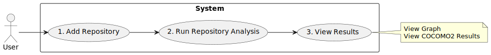

# TatMobile Software Requirements Specification Doc

## Table of contents

1. [Introduction](#introduction)
    - [Agreements](#agreements)
    - [Project Description](#project-description)
    - [Links](#links)
2. [Project Overview](#description)
    - [Stakeholders](#stakeholders)
    - [Decision Analysis](#solution-analysis)
    - [Metrics](#metrics)
3. [Requirements](#requirements)  
    - [User Stories & Interview](#user-stories)
    - [Use Cases](#use-cases)
    - [Quality Attributes](#quality-attributes)
4. [Architectural_Views](#architectural-views)
    - [Static](#static-perspective)
    - [Dynamic](#dynamic-perspective)
    - [Physical](#physical-perspective)
    - [Use-case diagram:](#use-case-diagram)
    - [Entity relationship diagram](#entity-relationship-diagram)
5. [Researches](#researches)

## Introduction 

The purpose of this document is to provide a comprehensive overview of the requirements for the
development of a developer contribution assessment tool. It serves as a guide for
stakeholders, developers, and project teams involved in the design, development, and implementation phases.
design, development, and implementation. The SRS describes the functional and
non-functional requirements that define the expected behavior and performance of the
of the system.

### Agreements 
The following conventions are used throughout this document:
- **Bold** text: represents section headings and important keywords.
- **Cursive**: Denotes variables, placeholders, or user input.
- Monospaced text: refers to code snippets, file names, and technical
terms.
- [External Link]: links to external documents or resources.

### Project Description 
The Developer Contribution Assessment Tool is designed to analyze repositories of
software repositories and provide metrics for evaluating developer contributions to a particular project.
a specific project. This tool will help stakeholders to make
informed decisions related to resource allocation, project management, and performance measurement.
performance evaluation. It includes a number of metrics including commit analysis,
code quality, collaboration patterns, and more.
Inclusions:
- Analysis of commit metrics (frequency, size, messages).
Exclusions:
- Detailed project management features (e.g., task tracking).
- Integration with external project management tools

### Links 
This document refers to the following documents, prototypes, and resources:
- [TatMobileAnalyzer repository](https://github.com/NikRam822/TatMobileAnalyzer)
- [Figma Prototype](https://www.figma.com/file/OE0pQL3mn4wlcng6o10AK3/ServiceDesign?type=design&node-id=264%3A1251&mode=design&t=XG83iR2C8fcI6gXF-1)
- [Toggle Report](https://track.toggl.com/shared-report/33a4e4c4755942c8ec8be3ea4c776dda)
- [Artifacts of 1st meeting](https://drive.google.com/drive/folders/1vgXjxCtzi7MA1MaR5vUygWJd_Ts-4vJQ?usp=drive_link)
- [Role Table](https://docs.google.com/spreadsheets/d/1XhRbq4rEerV7g63WXSJjuF9qFM0C1nxG2EsSbE144wI/edit?usp=sharing)
- [Other Artifacts](https://drive.google.com/drive/folders/1RKxz5tozCQmqkwWamR1bCjz847XtSwqx?usp=sharing)

## Project Overview 
### Stakeholders 

Below are some potential stakeholders and their interests in
regarding your developer contribution assessment tool:
1. Project Managers:
They are interested in understanding the overall performance and contribution of developers to the project.
Metrics such as commit frequency, code changes, and developer rating will be helpful to
them useful for project management and resource allocation.
2. business analysts:
Business analysts may be interested in the tool's ability to provide
insight into the efficiency of the development process. They could use this
data to identify areas of improvement and make informed decisions
regarding project strategies.
3. Development Team Leaders (TechLeads):
Team leaders want to assess the individual and collective performance of the members of
of their team members. They would be interested in detailed metrics on code quality, collaboration, and
any signs of potential problems such as code duplication or cheating.
4. Developers:
Developers themselves would be interested in how their contributions are measured. Honest and accurate
representation of their work, recognition of their efforts, and a tool that promotes healthy
competition and collaboration will be key developer interests.
5. Quality Assurance (QA) Team:
QA teams may be interested in metrics related to the quality of the
code, testing, and how changes made by developers affect the overall
stability of the project.
6. Company executives or management:
Company executives may be interested in the tool's ability to measure the
productivity and efficiency of the development team, ensuring efficient
utilization of company resources.
7. Human Resources (HR):
The human resources department can use this tool to evaluate the effectiveness of individual
developers, perhaps to analyze productivity or talent management.
8. Potential Stakeholders:
If applicable, investors may be interested in understanding the effectiveness and
productivity of the development team, as this directly impacts the success of the project.
9. External Auditors (if applicable):
If there are external auditing requirements, the ability of the tool to provide
transparent and accurate metrics may be important to ensure compliance with the
requirements.

### Decision Analysis 
The solution in this context is a repository with code to analyze the commit,
repository or code. The search was conducted on GitHub and GitLab using queries,
containing the words (commit, code, metrics, github, gitlab). This section presents a comparative table
of the solutions that we were able to find.

The next section deals with the problem of metrics for analyzing the productivity of a
of a programmer. A separate table presents a list of metrics with their description (purpose of using the metric) and disadvantages/advantages of using them.
of using the metric) and disadvantages/problems related to these metrics.

|Title| Description                                                                                                                                               | Metrics                                                                                                                                                                                                | Pros                                                                                                           | Minuses                                                           |
|-|--------------------------------------------------------------------------------------------------------------------------------------------------------|--------------------------------------------------------------------------------------------------------------------------------------------------------------------------------------------------------|-----------------------------------------------------------------------------------------------------------------|------------------------------------------------------------------|
|[Code Quality Report Analyzer](https://github.com/roshni-joshi/code-quality-report-analyzer)| A web application developed as a microservice architecture (React, Springboot and Python) to evaluate and visualize odor types in a git repository    | 1. Architecture,  2. Design,  3. Implementation,  4. Test, and  5. Testability Smells                                                                                                  | 1. The system has a ready-made UI with ready-made dashboards.  2. There is detailed documentation | It's hard to customize to your solution                             |
|[GitLab Analytics](https://github.com/NDHWAlliance/gitlab-analytics)| Tool (system) for analyzing developer activity GitLab repository                                                                          | 1. commits  2. wikis  3. issues  4. comments  5. merge-request                                                                                                                         | Simple, easy to understand project with startup instructions                                                                  | No detailed documentation, tool gives error during operation |
|[GitLab Commit Statics](https://github.com/ccbuildpro/GitLabCommitStatics/tree/master)| A very simple script to collect project statistics in GitLab                                                                                          | metrics from GitLab API                                                                                                                                                                                  | Simple code                                                                                                     | In Chinese                                               |
|[New Relic GitLab Exporter](https://github.com/newrelic-experimental/gitlab)| A Gitlab exporter that sends metrics, logs, and traces to New Relic                                                                        | CI/CD metrics                                                                                                                                                                                          | As an example of integration                                                                                    | Poor documentation                                              |
|[GitLab Prometheus solution](https://github.com/owentl/gitlab-prometheus/tree/main)| Prometheus metrics generator based on gitlab issues                                                                                                    | issue_weight, issue_status, time_estimate, time_spent and other 21 values                                                                                                                              | Simple code, there is a dockerfile                                                                                    | No                                                              |
|[DORA Metrics](https://about.gitlab.com/solutions/value-stream-management/dora/#overview)| A solution for analysts and devops engineers                                                                                                              | 1. deployment frequency,  2. the time to execute the changes,  3. average recovery time  4. change failure rates and other CI/CD metrics                                            | Commercial solution, easy to connect. API with a large number of metrics                                          | No |
|[GitLab DevOps Metrics on Go](https://github.com/denniskribl/gitlab-devops-metrics)| Tool for collecting metrics about CI/CDs                                                                                                                    | commits & deployments                                                                                                                                                                                  | GOLANG                                                                                                       | Not a lot of code |
|[Extract GitLab Merge Metrics](https://github.com/hadisfr/extract-gitlab-merge-metrics)| A tool for collecting GitLab merge metrics                                                                                                               | merge (time, hash and so on)                                                                                                                                                                           | There is an example of using api (in code)                                                                          | Pet project |
|[Git Commit Metrics](https://github.com/llbit/git-commit-metrics)| A tool for counting commits and adds (GitHub)                                                                                                 | 1. Commit Count,  2. Inserted,  3. Removed.                                                                                                                                                    | A very simple example of working with GitHub                                                                            | Pet project|
|[GH Metrics Collector](https://github.com/davelosert/gh-metrics-collector)| Collect some Github Committer and Pull-Requests metrics from the API GitHub                                                                           | 1. commitDate,  2. commitSHA,  3. commitAuthor,  4. repository,  5. organisation. Same for pull-requests                                                                           | Outputs the result in a csv file, tightening the integration with excel                                                     |Small project|
|[WHIP](https://github.com/slincastro/whip/tree/main)| Collects the default GitHub metrics                                                                                                                   | GitHub commit info                                                                                                                                                                               | Just as an example, okay.                                                                                        |Pet project|
|[Radon](https://github.com/rubik/radon)| A code parser that collects various Python metrics                                                                                                    | 1. cyclomatic complexity,  2. raw metrics (these include SLOC, comment lines, blank lines, &c.) 3. Halstead metrics (all of them) 4. Maintainability Index (the one used in Visual Studio) | A very good example of how to do this project in Python. Also the project provides normal documentation | Indirect solution |
|[CK](https://github.com/mauricioaniche/ck)| Static code parser that collects Java metrics                                                                                                 | About 36 meters!                                                                                                                                                                                       | Open source, the project is supported by the community                                                                 |No documentation|
|[DesigniteJava](https://github.com/tushartushar/DesigniteJava)| Static code parser that analyzes code quality for Java                                                                                    | Collects about 40 values!                                                                                                                                                                           | Open source code, documentation available                                                                                 |Indirect solution|

### Metrics 
Estimating programmer productivity using code and commit metrics faces
several significant problems. First, such metrics often provide
insufficient information to fully assess the labor intensity and quality of work. The focus
on quantitative metrics, such as number of lines of code or commit frequency, can
lead to underestimating meaningful aspects of programming.

Another problem is that metrics can focus on quantity without paying
adequate attention to quality. An evaluation based solely on the amount of code or the number of
commits does not capture the creative and innovative aspects of a programmer's work.

Inequity can also arise from the use of metrics that do not take into account the
differences in the complexity of the tasks that programmers face. In addition, a focus on
individual evaluation can lead to ignoring contributions to teamwork and
team effort.

There is also a risk of deteriorating code quality due to a focus on metrics, since
programmers may strive to increase the amount of code without proper attention to its
quality. The unpredictability of external factors, such as changes in requirements or deadlines,
also introduces uncertainty into productivity estimates, making them less reliable and
objective.

We have formed the following table as an analysis:

|Metric | Description | Minuses                                                                                                                                                                                       | Pros                                                                                                                                                                                                                                   |
|-|-|----------------------------------------------------------------------------------------------------------------------------------------------------------------------------------------------|-----------------------------------------------------------------------------------------------------------------------------------------------------------------------------------------------------------------------------------------|
|Commits Count|Counts the number of commits made by a particular user| Developers can make lots of small, inconsequential commits to improve their performance                                                                                          | 1. easy to understand and calculate.  2. Provides an overview of the developer's involvement in the project.  3. Useful for tracking trends in developer activity over time.                                           |
|Commit Size|Measures the size or lines of code changed on each commit.| Programmers may start artificially increasing the amount of code.                                                                                                                              | 1. Helps you determine the scope of changes made by the developer to each commit.  2. May indicate whether the developer makes a major or minor contribution.  3. Useful for understanding the complexity and impact of change.   |
|Commit Frequency|Checks how often the developer makes changes to the repository.| 1. An excessive number of small commits can clutter the repository and hide meaningful changes.  2. Does not take into account different development approaches (daily vs weekly commits) | 1. Provides insight into the consistency and work habits of the developer.  2. Helps identify periods of high or low activity.  3. Useful for understanding development workflow patterns.           |
|Commit Messages|Evaluates the quality and informativeness of commit messages.| It is impossible to assess the quality of the descriptions.                                                                                                                                                        | 1. Helps you evaluate the clarity and purpose of each commit.  2. Promotes better understanding and cooperation among team members.  3. Supports effective documentation of changes.                                   |
|Branch Management|Checks how well the developer handles branching, merging, and conflict resolution.| 1. Improper branch management can have a negative impact on performance.  2. merg is done only by team leaders.                                                                      | 1. Indicates the developer's knowledge of version control techniques.  2. reflects collaborative skills and the ability to work in parallel with others.  3. can highlight areas where improvements in code integration may be needed. |
|Lines of Code (LOC)|Measures the number of lines of code added, modified, or deleted by the developer.| You can manipulate by writing detailed code or creating unnecessary lines.                                                                                                            | 1. easy to understand and calculate.  2. Provides an overview of the developer's involvement in the project.  3. Useful for tracking trends in developer activity over time.                                           |
|Code outflow|Monitors the frequency of code changes (addition, modification, deletion) by the developer.| High churn may indicate that there is no need , but not necessarily the productivity of the developer.                                                                                           | 1. You can point to a trial lesson in the code.  2. Bring out a trial lesson in trebling.  3. Helps to determine the competence of the developer.                                                                                        |
|Feedback on the code review|Specifies the quality of remote communication, the transfer discharge during code verification.| Lack of functionality; quality may vary depending on the renzent.                                                                                                       | 1. It is possible for use in a team (friendly, etc.).  2. It helps to identify active abilities.                                                                                                                         |
|Code duplication|It is used only for duplicating code in the repository.| Pre-duplication or additional code libraries are not taken into account.                                                                                                                        | 1. You can talk about the weaknesses of the code.  2. Perhaps in the analysis of the developer's contribution and competence.                                                                                                                               |
|Test coverage|Measures the skipping of code hidden by automated tests.| High coverage is not a guarantee of code quality, and critical paths may be surprised out of sight.                                                                                                | 1. You can find out who contributed to the quality improvement.  2. It is possible to analyze the trend of code closure.                                                                                                                  |
|Difficulty code|Evaluates the complexity of the code using indicators such as cyclomatic complexity.| May punish developers for solving complex problems; does not take into account readability.                                                                                                         | 1. Perhaps in the analysis of the developer's contribution and competence.  2. It might be worth noting a trial lesson.                                                                                                                                |
|Halsted indicators|The Halsted complexity score is used to measure the complexity of the software without running the program itself.| It's hard to count (takes up some resources). There is also a high risk of misinterpreting the metric.                                                                                   | 1. Perhaps in the analysis of the developer's contribution and competence.  2. Perhaps to mark a trial lesson.  3. It can highlight effective sections of the code.                                                                                    |
|Speed of error correction|Measures the time it takes to delete downloaded files.| Adjusts the firmware effort; can simulate rapid changes in space over long periods.                                                                                      | Allows you to track the effectiveness and speed of the developer in correcting errors, which can be an indicator of the quality of his work.                                                                                                       |
|Error detection rate|Number of problems| You can automatically report the appearance of corrections.                                                                                                                                        | It is possible to determine who found the errors and how quickly the errors are detected.                                                                                                                                                                       |
|Collaboration indicators|Remote collaborations are monitored, such as reviewing inclusion requests, discussing, and interacting with other users.| No distinguishes between positional and negative impacts; cannot account for individual contributions.                                                                                               | evaluates the level of cooperation and interaction between the developer and other team members |
|Implementation of functions|Measures the success of introducing new features or user stories.| Ignores bug fixes and improvements; may prefer quantity over quality.                                                                                            | helps to evaluate the developer's performance and contribution to product development.                                                                                                                                                         |

[Addition](https://github.com/fidelfsd/github-contribution-metrics-calculator ) to add a contribution:

## Requirements 

### User stories and interviews 

We spent [interview](https://docs.google.com/document/d/1pwAjxJPs9LU4H7_KMHYaM-hU8M7mZpCa0NgpfP91AxQ/edit?usp=sharing ) with the customer, having prepared the following set of [questions](https://docs.google.com/document/d/1dITTNL3w4Nm5OYabG7NFlqX_Moi9ChzRL9fGyZD6MTE/edit ). We have saved them as
as a guideline to gain a full understanding of the project context and
customer expectations. From the interview, we highlighted the following requirements:

1. As a client, I want to receive a report in csv, json files (required):
- As an analyst or client, I want to select a repository and receive analytics in csv format,
json or output to the terminal.
2. The ability to run the service locally (required):
- As a developer, I want to provide the ability to run the service locally on my computer.
   a laptop for easy development and testing.
3. Instructions for improving the service (required documentation/README):
- As a development engineer, I want to provide instructions for improving the service for
   Frontend developers to simplify the integration process.
4. Service availability in the cloud (possibly a deployed service):
   - As a customer, I want to be able to access the service remotely.
5. Integration of analysis with the GitHub version control system (required):
- As a developer, I want the analysis system to be able to handle the GitHub repository.
6. Integration of the analysis with the GitLab version control system (required):
   - As a developer, I want the analysis system to be able to handle the GitLab repository.
7. Processing unique lines of code (required):
- As a manager, I want to be able to analyze unique lines of code (without
duplication between commits).
8. Accounting for the frequency of commits and their content (required):
- As an analysis system, I want to take into account not only the number of commits, but also their content,
in order to evaluate not only the activity of the developer, but also the quality of his work.
9. User roles and data access (required):
   - As a system administrator, I want to manage user roles and their access to
data to ensure the security and confidentiality of information.
10. Integration with the existing user interface (there must be an API server or database):
    - As a developer, I want to integrate performance analytics into an existing
User Interface to provide a single point of access to functionality.
11. Accounting for different modes of operation of VCS (must):
- As a manager, I want the system to take into account different modes of operation with VCS
    a version control system (for example, the accumulation of commits or their regular sending, perhaps
    writing a wiki) to account for the behavior of developers.
12. Visualization of the analysis results: (must be web or UI/UX)
- As a user, I want to see the analysis results in a convenient visual form (graphs,
diagrams) in order to quickly assess the effectiveness of projects and developers.
13. Development of flexible visualizations and reports (should):
- As a user, I want to have access to flexible visualizations and reports for
    analyze the performance of projects and developers in a convenient way.
14. Develop an algorithm that takes into account the complexity of the code (Should - Epic):
- As a programmer, I want to develop an algorithm that takes into account not only the total number
of lines of code, but also the complexity and uniqueness of code structures to obtain more accurate estimates.
15. Support for various repository formats (should):
- As a developer, I want to provide support for various repository formats
(open and closed) to meet the needs of different users.
16. Aggregation of changes in the scope of the code (Could - web or UI/UX):
- As a project manager, I want to see how the scope of the source code changes during
    a certain period of time to assess the dynamics of development.
17. Filtering and aggregation of data by the developer (possibly web or UI/UX):
- As a manager, I want to be able to filter and aggregate data
by developers in order to get statistics of their contribution to the project.
18. Accounting for the quality of the code for bugs and defects (Could - Epic):
    - As a manager, I want to add functionality in the future to account for the quality of the code for bugs and defects.
    defects to improve the analysis.
19. Considering the need for an API in the future (Could be an API endpoint consultant with stakeholders):
- As a technical supervisor, I want to take into account the possibility of developing an API for
interacting with the user interface in the future to provide a more flexible
    integration. The need for API documentation

### Use Cases 

##### 1. Integration of analysis with the Git version control system.
| | Description |
| ----- |-----------------------------------------------------------------------------------------------------------------------------------------------------------------------------------------------------------------------------------------------------------------------------------------------------------------------------------------------------------------------------------|
| Name:                                                | Integration with Git.                                                                                                                                                                                                                                                                                                                                                                 |
| Description:                                                | The manager adds a Git repository to the system for analysis.                                                                                                                                                                                                                                                                                                                         |
| Actors: | Manager |
| Preconditions:                                             | The manager has access to the data analysis system and the repository on Git.                                                                                                                                                                                                                                                                                                              |
| Main Event stream:                                  | 1. The manager adds the Git repository using its URL for analysis to the system. 2. The analysis system gets access to the Git repository and parses the repository data (number of lines of code, commit data and their contents, contributor data) 3. The system displays the success of data parsing and enters the state of a request to start analyzing this data. |
| Postconditions:                                             | The analysis system has gained access to the data from the Git repository and is ready to perform the analysis.                                                                                                                                                                                                                                                                                        |

##### 2. Getting information about commits.

| | Description |
| -----|-------------------------------------------------------------------------------------------------------------------------------------|
| Name:                                    | Getting information about commits |
| Description:                                    | The manager can get information about commits to analyze the effectiveness of developers.                                              |
| Actors: | Manager |
| Preconditions:                                 | The manager provided the repository data in advance for its analysis |
| Main Event stream:                      | 1. The manager requests information about commits (via the interface). 2. The system accesses the database or logs and receives data about commits. |
| Postconditions:                                 | The manager has received information about commits |
##### 3. Analyzing changes in the source code scope. 
| | Description |
| -----|-------------------------------------------------------------------------------------------------------------------------------------|
| Name:                                           | Analysis of code volume changes|
| Description:                                           |The manager sees changes in the volume of each developer's source code over a certain period of time to assess the dynamics of development.|
| Actors: | Manager|
| Preconditions:                                        |The manager has access to the data analysis system. |
| The main stream of events:                             |1. The manager selects a time period for analyzing changes in the volume of the code. 2. The system analyzes the changes in the amount of code made by each developer over a selected period of time.|
| Postconditions:                                        | The manager has received information about changes in the volume of the source code.|

##### 4. Filtering and aggregation of data by developers.

| | Description |
| -----|---------------------------------------------------------------------------------------------------------------------------------------------------------|
|Name:| Data filtering and aggregation |
|Description:| The manager filters and aggregates data on developers to get statistics on their contribution to the project.                                                    |
|Actors:| Manager |
|Preconditions:| The manager has access to the data analysis system.                                                                                                         |
|Main Event stream:| 1. The manager sets up filters for aggregating data by developers. 2. The system aggregates data according to the selected filters. |
|Postconditions:| The manager received statistics on the contribution of developers to the project |

##### 5. Analysis of unique lines of code.

| | Description |
| -----|---------------------------------------------------------------------------------------------------------------------------------------|
|Name:| Analyzing unique lines of code |
|Description:| The manager analyzes unique lines of code (without duplicates) to assess the quality of development.                                          |
|Actors:| Manager |
|Preconditions:| The manager has access to the data analysis system.                                                                                       |
|Main Event stream:| 1. The manager starts analyzing unique lines of code. 2. The system analyzes unique lines of code, excluding duplicates among commits. |
|Postconditions:| The manager has received information about unique lines of code.                                                                               |

##### 6. Visualization of the analysis results.

| | Description |
| -----|---------------------------------------------------------------------------------------------------------------------------------------------------|
|Name:| Visualization of the analysis results |
|Description:| The manager sees the results of the analysis in a convenient visual form (graphs, diagrams) to evaluate the effectiveness of projects and developers.       |
|Actors:| Manager |
|Preconditions:| The manager has access to the data analysis system.                                                                                                   |
|Main Event stream:| 1. The manager reviews the results of the analysis. 2. The system generates graphs, charts and other visualizations to display the results of the analysis. |
|Postconditions:| The manager assessed the effectiveness of the projects and developers.                                                                                    |

##### 7. Accounting for different models of working with VCS.

| | Description |
| -----|----------------------------------------------------------------------------------------------------------------------------------------------------------|
|Name:| Accounting for models of working with VCS |
|Description:| The system takes into account various models of working with the version control system when analyzing data.                                                             |
|Actors:| Analysis system |
|Preconditions:| Access to data from version control systems.                                                                                                           |
|Main Event stream:| 1. The analysis system analyzes the number of commits and their contents. 2. The analysis system takes into account various models of working with the version control system. |
|Postconditions:| The analysis system is adapted to various models of working with VCS.                                                                                           |

##### 8. Development of flexible visualizations and reports.

| | Description |
| -----|----------------------------------------------------------------------------------------------------------------------------------------------------------|
|Name:|Development of visualizations and reports|
|Description:|The manager has access to flexible visualizations and reports to analyze the effectiveness of projects and developers.|
|Actors:|Manager|
|Preconditions:|Access to the data analysis system.|
|The main stream of events:|1. The manager creates flexible visualizations and reports to analyze the effectiveness of projects and developers.|
|Postconditions:|The manager received the information in a convenient form for analysis.|

##### 9. Accounting for the quality of the code for errors and defects.

| | Description |
| -----|----------------------------------------------------------------------------------------------------------------------------------------------------------|
|Name:|Code quality accounting|
|Description:|The analyst adds the functionality of accounting for the quality of code for errors and defects to improve the analysis. |
|Actors:|Analyst|
|Preconditions:|Access to data about errors and defects in the code.|
|Main Event stream:|1. The analyst adds the functionality of accounting for the quality of code for errors and defects. |
|Postconditions:|The analysis system takes into account the quality of the code for errors and defects.|

##### 10. User roles and data access.

| | Description |
| -----|----------------------------------------------------------------------------------------------------------------------------------------------------------|
|Name:|Managing roles and access|
|Description:|Admin manages user roles and their access to data to ensure the security and confidentiality of information.|
|Actors:|Administrator|
|Preconditions:|Access to the role and access management system.|
|Main event flow:|1. The administrator manages user roles and their access to data.|
|Postconditions:|User roles and access to data have been updated according to the administrator settings.|
##### 11. Integration with the existing UI.

| | Description |
| -----|----------------------------------------------------------------------------------------------------------------------------------------------------------|
| Name:                                     | Integration with the UI |
| Description:                                     | The developer integrates performance analysis into the existing user interface to provide unified access to functionality.        |
| Actors: | Developer |
| Preconditions:                                  | Access to the existing user interface.        |
| Main Event stream:                       | 1. The developer integrates performance analysis into the existing user interface.        |
| Postconditions:                                     | The performance analysis functionality is available in the existing user interface.        |
### Quality Attributes 

The following are the architectural drivers for the developer contribution assessment system:
##### 1. Main functions:
1. Periodic analysis:
- The system must periodically analyze software repositories
      to ensure that the developers' contributions are consistent and accurate
      it is measured over time.
      - Periodic analysis allows you to track and track contribution trends
      developers, providing stakeholders with an idea of
      the long-term dynamics of the project. 
   2. Multi-customer support:
        - The system must support multiple clients simultaneously sending
        links to your repositories for analysis.
        - This facilitates collaboration between different project teams or
organizations, allowing them to independently analyze and track their contributions.
        developers.
      
##### 2. Quality Attributes:
1. Performance:
      - The repository analysis should be completed within a reasonable time, ideally within
      15 minutes after receiving the link to the repository.
      – Ensures timely availability of indicators, supports fast
      decision-making and improves user experience.
   2. Accuracy:
      - The system should provide accurate indicators, avoiding false positive or
negative results when evaluating the contribution of developers.
      – Maintaining the integrity of indicators is crucial for decision-making
      informed decisions regarding resource allocation and management
      projects.
   3. Scalability:
      - The architecture must be scalable to meet the growing number of
      requests for repository analysis without compromising performance.
      - This supports the implementation of the tool by large organizations or projects with
      an extensive code base.
      
##### 3. Business Constraints:
1. Regulatory Compliance:
- The tool must comply with all relevant industry and legal requirements
      standards governing code analysis and developer metrics.
      - This ensures compliance with external standards and minimizes legal
      risks associated with data analysis.
      
##### 4. Technical limitations:
1. Integration flexibility:
- The system must be designed to integrate with various
      version control systems and adaptation to various repository structures.
      - This makes the tool versatile and compatible with various environments
      developments.
   2. Security:
      - Reliable security measures must be implemented in the system to protect
      confidential information related to the code and user data.
      - Measures to protect against potential security threats and unauthorized access
      to repositories of confidential code.
## Architectural Views 
    
### Static 

#### Module diagram

### Dynamic 

#### General models diagram

#### Sequence diagram
[PlantUML code](https://www.plantuml.com/plantuml/uml/lPF1JiCm38RlUGfhzxq01pHA1UB4DBG7i59NirYJaBW3tXulbBQ9E76WXyQA-zd__qlT9S4eut26P4yqe44hFi8nKJH1Esmve1DuYDu9kQwuRD2-rdURHnQuspzj01DehMNPRr5GoKJvYxOnvheCjhVpZXjuqJTqA5aENr1e4V1JA349KE10RoCbAPbPttGgCIbQ0F4m2LwmIVNt0TlrdYo-ZtwOgOugRhsjRTGBNgZIfQRRfXnyxrtFSK1Xxy3ta9JIsMjadbj4TQ0Kl4i4xoodl6UDPQO8JU5htcg5KpZZPuqiGHiV19wT9M07wfe_g8D0aNrdG9zVKjtdBbk8_nRlCQY1FmGyPgwAEDisEptqZ_W2)

### Physical 
Soon

### Use-case diagram 

### Entity relationship diagram 
Database model based on multitenant architecture

)

## Researches 
#### The following reserches were conducted:
- [GitHub API Research](https://docs.google.com/document/d/15Igu6dCziBG-8ZnpGVz-e2CEmNE1FiWU-ww2rb4NJPs/edit?usp=drive_link)
- [GitHub Research on data Pagination](https://docs.google.com/document/d/1ru0m5S0KVRK0qL7OHI5eUc1Yw4FrYyxgCsc_vPG6FXU/edit#heading=h.bm8wzw7ge9v9)
- [Data Storage Analysis](https://docs.google.com/document/d/1ru0m5S0KVRK0qL7OHI5eUc1Yw4FrYyxgCsc_vPG6FXU/edit?usp=drive_link)
- [!IN PROGRESS! Risk cases to the system](https://docs.google.com/document/d/1TSd8iSaXevZByvwJCiV5CzDeVhR6sPA-QrsVgDPzbu8/edit?usp=drive_link)
