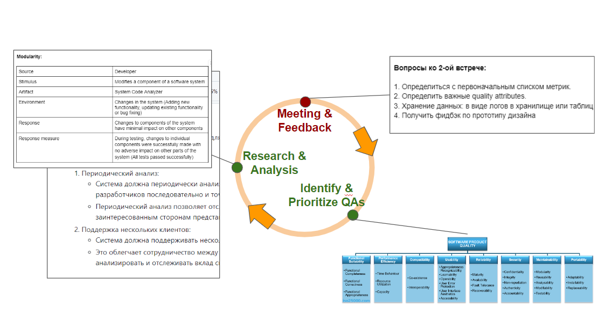

# TatMobileAnalyzer Docs

Welcome to our documentation! This guide will help you find your way around the various files and sections.

## Table of Contents

1. [Practice Areas](#practice)
2. [Navigation](#navigation)

## Practice Areas 

We have prepared presentations for each practice area, focusing primarily on our activities, tools, and artifacts:

### [Context & requirements](https://docs.google.com/presentation/d/10LQMEnqjGyXT6bjqqwgGLAqfKdvsYcUmTSZ4ySaXE68/edit#slide=id.g2bf4626b8f0_2_45):

### [Planning & Tracking](https://docs.google.com/presentation/d/1RxE21MRGgMtd_o3Fw0LY9T-XuaTw2wiYoiNQLlVQlvc/edit#slide=id.g2c145daf49c_0_0)

### [Quality](https://docs.google.com/presentation/d/1sNMJkVtir0d8Xq8AJtGDbrwqm9qHnfdOJVQe_QdA53w/edit#slide=id.g2c145daf49c_0_0)

### [Architectural Design](https://docs.google.com/presentation/d/16PEuTRjsOlHsv0-apAT97AWRIrPep4iuqRi0tT9V_aY/edit#slide=id.g2c145daf49c_0_0)

### [Risk management](https://docs.google.com/presentation/d/1OFszMaOglWX0m5Tn667dteWtcb8elPTsDsy8pZfYMdM/edit#slide=id.g2c16c5cf016_0_0)

### [Configuration Management](https://docs.google.com/presentation/d/1p8p3ND9ekFV0kQYP5uz2qg-jBIxjGlojWWQ-190fW6c/edit#slide=id.g2bf447eed3b_3_45)

## Navigation 

### Folders and Docs:

1. [Media Folder](#media)
2. [GitHub API Documentation](#git-api)
3. [Reviews](#reviews)
4. [Risk Cases](#risks)
5. [Specification](#specs)
6. [English Specification](#specs-en)
7. [Workflow](#workflow)

### Media Folder 

The `media` folder contains multimedia assets such as images, videos, and other resources. You can explore this folder to find relevant media files.

### GitHub API Documentation 

- GITHUB_API_1.md: Detailed information about our GitHub API endpoints.
- GITHUB_API_2.md: Additional API documentation.

### Reviews 

- reviews.md: Insights and feedback from users or stakeholders.

### Risk Cases 

- RISK_CASES.md: Descriptions of potential risks (for the system) and mitigation strategies.
  if you want to see docs about risk management for project go to: https://docs.google.com/document/d/1r-DMl_w5Weh2feIyDAqa6wvW2nTsmPeoPz0USZGH_8M/edit?usp=sharing

### Specification 

- SPECIFICATION.md: Technical specifications for our project.

### English Specification 

- SPECIFICATION_EN.md: English version of the technical specifications.

### Workflow 

- WORKFLOW.md: Workflow guidelines and best practices.

Feel free to explore these files and dive deeper into the details. If you have any questions, don't hesitate to ask!
