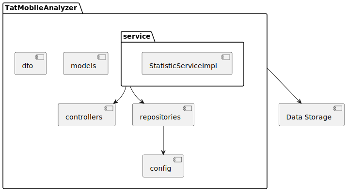
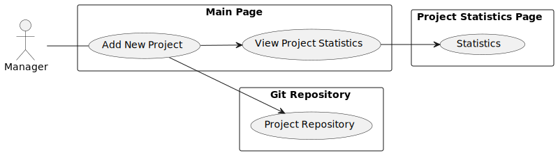
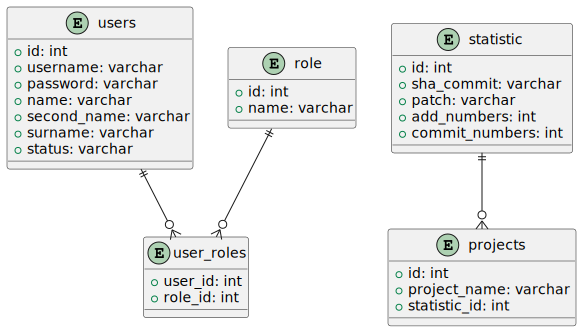

# TatMobile Software Requirements Specification Doc

## Оглавление

1. [Введение](#introduction)
    - [Условные Обозначения](#agreements)
    - [Описание Проекта](#project-description)
    - [Ссылки](#links)
2. [Обзор Проекта](#description)
    - [Stakeholders](#stakeholders)
    - [Анализ Решений](#solution-analysis)
    - [Метрики](#metrics)
3. [Требования](#requirements)  
    - [User Stories & Интервью](#user-stories)
    - [Use Cases](#use-cases)
    - [Quality Attributes](#quality-attributes)
4. [Architectural_Views](#architectural-views)
    - [Static](#static-perspective)
    - [Dynamic](#dynamic-perspective)
    - [Physical](#physical-perspective)

## Введение 

Целью этого документа является предоставление всестороннего обзора требований к
разработке инструмента оценки вклада разработчиков. Он служит руководством для
заинтересованных сторон, разработчиков и проектных групп, участвующих на этапах
проектирования, разработки и реализации. SRS описывает функциональные и
нефункциональные требования, определяющие ожидаемое поведение и производительность
системы.

### Условные Обозначения 
В этом документе используются следующие соглашения:
- **Жирный** текст: представляет заголовки разделов и важные ключевые слова.
- *Курсив*: Обозначает переменные, заполнители или вводимые пользователем данные.
- Моноширинный текст: относится к фрагментам кода, именам файлов и техническим
терминам.
- [Внешняя ссылка]: ссылки на внешние документы или ресурсы.

### Описание Проекта 
Инструмент оценки вклада разработчиков предназначен для анализа репозиториев
программного обеспечения и предоставления показателей для оценки вклада разработчиков в
конкретный проект. Этот инструмент поможет заинтересованным сторонам принимать
обоснованные решения, связанные с распределением ресурсов, управлением проектами и
оценкой эффективности. Он включает в себя ряд показателей, включая анализ коммитов,
качество кода, шаблоны совместной работы и многое другое.
Включения:
- Анализ метрик коммитов (частота, размер, сообщения).
Исключения:
- Подробные функции управления проектами (например, отслеживание задач).
- Интеграция с внешними инструментами управления проектами

### Ссылки 
Этот документ ссылается на следующие документы, стандарты и ресурсы:
[TatMobileAnalyzer repository](https://github.com/NikRam822/TatMobileAnalyzer)

## Обзор Проекта 
### Stakeholders 

Ниже приведены некоторые потенциальные заинтересованные стороны и их интересы в
отношении вашего инструмента оценки вклада разработчиков:
1. Менеджеры проектов:
Они заинтересованы в понимании общей производительности и вклада разработчиков в проект.
Такие показатели, как частота коммитов, изменения кода и рейтинг разработчиков, будут для
них полезны для управления проектами и распределения ресурсов.
2. Бизнес-аналитики:
Бизнес-аналитики могут быть заинтересованы в способности этого инструмента дать
представление об эффективности процесса разработки. Они могли бы использовать эти
данные для определения областей улучшения и принятия обоснованных решений
относительно стратегий проекта.
3. Руководители группы разработчиков (TechLeads):
Руководители команд хотят оценивать индивидуальную и коллективную эффективность членов
своей команды. Им были бы интересны подробные показатели качества кода, сотрудничества и
любых признаков потенциальных проблем, таких как дублирование кода или мошенничество.
4. Разработчики:
Сами разработчики будут заинтересованы в том, как измеряется их вклад. Честное и точное
представление их работы, признание их усилий и инструмент, способствующий здоровой
конкуренции и сотрудничеству, будут ключевыми интересами разработчиков.
5. Команда обеспечения качества (QA):
Команды контроля качества могут быть заинтересованы в показателях, связанных с качеством
кода, тестированием и тем, как изменения, внесенные разработчиками, влияют на общую
стабильность проекта.
6. Руководители или руководство компании:
Руководители компании могут быть заинтересованы в способности этого инструмента измерять
продуктивность и эффективность команды разработчиков, гарантируя эффективное
использование ресурсов компании.
7. Человеческие ресурсы (HR):
Отдел кадров может использовать этот инструмент для оценки эффективности отдельных
разработчиков, возможно, для анализа производительности или управления талантами.
8. Потенциальные заинтересованные стороны:
Если применимо, инвесторы могут быть заинтересованы в понимании эффективности и
продуктивности команды разработчиков, поскольку это напрямую влияет на успех проекта.
9. Внешние аудиторы (если применимо):
Если существуют требования к внешнему аудиту, способность инструмента предоставлять
прозрачные и точные показатели может иметь важное значение для обеспечения соответствия
требованиям.

### Анализ Решений 
Решением в данном контексте является репозиторий с кодом для анализа коммита,
репозитория или кода. Поиск проводился на GitHub и GitLab с использованием запросов,
содержащих слова (commit, code, metrics, github, gitlab). В этом разделе представлена сравнительная таблица
решений, которые нам удалось найти.

В следующем разделе рассматривается проблема метрик для анализа продуктивности
программиста. В отдельной таблице представлен список метрик с описанием (цель
использования метрики) и минусами/проблемами, связанными с этими метриками.

|Название| Описание                                                                                                                                               | Метрики                                                                                                                                                                                                | Плюсы                                                                                                           | Минусы                                                           |
|-|--------------------------------------------------------------------------------------------------------------------------------------------------------|--------------------------------------------------------------------------------------------------------------------------------------------------------------------------------------------------------|-----------------------------------------------------------------------------------------------------------------|------------------------------------------------------------------|
|[Code Quality Report Analyzer](https://github.com/roshni-joshi/code-quality-report-analyzer)| Веб-приложение, разработанное в виде микросервисной архитектуры (React, Springboot и Python) для оценки и визуализации типов запахов в репозитории git | 1. Architecture,  2. Design,  3. Implementation,  4. Test, and  5. Testability Smells                                                                                                  | 1. Система имеет готовый UI с готовыми дашбордами.  2. Есть подробная документация                          | Тяжело адаптировать под свое решение                             |
|[GitLab Analytics](https://github.com/NDHWAlliance/gitlab-analytics)| Инструмент (система) для анализа активностей разработчиков GitLab репозиторий                                                                          | 1. commits  2. wikis  3. issues  4. comments  5. merge-request                                                                                                                         | Простой, понятный проект с инструкцией запуска                                                                  | Нету подробной документации, инструмент выдает ошибку при работе |
|[GitLab Commit Statics](https://github.com/ccbuildpro/GitLabCommitStatics/tree/master)| Очень простой скрипт для сбора статистики по проекту в GitLab                                                                                          | метрики от GitLab API                                                                                                                                                                                  | Простой код                                                                                                     | На китайском языке                                               |
|[New Relic GitLab Exporter](https://github.com/newrelic-experimental/gitlab)| Экспортер Gitlab, который отправляет метрики, журналы и трассировки в New Relic                                                                        | метрики CI/CD                                                                                                                                                                                          | Как пример интеграции пойдет                                                                                    | Плохая документация                                              |
|[GitLab Prometheus solution](https://github.com/owentl/gitlab-prometheus/tree/main)| Генератор метрик Prometheus на основе gitlab issues                                                                                                    | issue_weight, issue_status, time_estimate, time_spent and other 21 values                                                                                                                              | Простой код, есть dockerfile                                                                                    | Нет                                                              |
|[DORA Metrics](https://about.gitlab.com/solutions/value-stream-management/dora/#overview)| Решение для аналитиков и devops инженеров                                                                                                              | 1. частота развертывания,  2. время выполнения изменений,  3. среднее время восстановления  4. частота отказов изменений и другие CI/CD метрики                                            | Коммерческое решение, легко подключаемое. API с большим кол-вом метрик                                          | Нет |
|[GitLab DevOps Metrics on Go](https://github.com/denniskribl/gitlab-devops-metrics)| Инструмент для сбора метрик о CI/CD                                                                                                                    | commits & deployments                                                                                                                                                                                  | На GOLANG                                                                                                       | Мало кода |
|[Extract GitLab Merge Metrics](https://github.com/hadisfr/extract-gitlab-merge-metrics)| Инструмент для сбора GitLab merge метрик                                                                                                               | merge (time, hash and so on)                                                                                                                                                                           | Есть пример использывания api (в коде)                                                                          | Pet project |
|[Git Commit Metrics](https://github.com/llbit/git-commit-metrics)| Инструмент для подсчета коммитов и добавлений (GitHub)                                                                                                 | 1. Commit Count,  2. Inserted,  3. Removed.                                                                                                                                                    | Очень простой пример работы с GitHub                                                                            | Pet project|
|[GH Metrics Collector](https://github.com/davelosert/gh-metrics-collector)| Соберите некоторые показатели Github Committer и Pull-Requests из API GitHub                                                                           | 1. commitDate,  2. commitSHA,  3. commitAuthor,  4. repository,  5. organisation. Same for pull-requests                                                                           | Выводит результат в csv файле, облегачая интеграцию с excel                                                     |Small project|
|[WHIP](https://github.com/slincastro/whip/tree/main)| Собирает метрики GitHub по умолчанию                                                                                                                   | GitHub коммит информация                                                                                                                                                                               | Просто как пример - окей                                                                                        |Pet project|
|[Radon](https://github.com/rubik/radon)| Парсер кода, который собирает разные Python метрики                                                                                                    | 1. cyclomatic complexity,  2. raw metrics (these include SLOC, comment lines, blank lines, &c.) 3. Halstead metrics (all of them) 4. Maintainability Index (the one used in Visual Studio) | Очень хороший пример, как выполнить данный проект на Питоне. Также проект предоставляет нормальную документацию | Косвенное решение |
|[CK](https://github.com/mauricioaniche/ck)| Статический парсер кода, который собирает Java метрики                                                                                                 | Около 36 метрик!                                                                                                                                                                                       | Открытый код, проект поддерживается сообществом                                                                 |Нет документации|
|[DesigniteJava](https://github.com/tushartushar/DesigniteJava)| Статический парсер кода, который анализирует качество кода для Java                                                                                    | Собирает около 40 значений!                                                                                                                                                                            | Открытый код, есть документация                                                                                 |косвенное решение|

### Метрики 
Оценка продуктивности программистов с использованием метрик кода и коммитов сталкивается
с несколькими существенными проблемами. Во-первых, такие метрики часто предоставляют
недостаточно информации, чтобы полноценно оценить трудоемкость и качество работы. Фокус
на количественных показателях, таких как количество строк кода или частота коммитов, может
привести к недооценке значимых аспектов программирования.

Другая проблема связана с тем, что метрики могут сосредотачиваться на количестве, не уделяя
должного внимания качеству. Оценка, основанная исключительно на объеме кода или числе
коммитов, не улавливает творческие и инновационные аспекты работы программиста.

Несправедливость также может возникнуть из-за применения метрик, не учитывающих
различия в сложности задач, с которыми сталкиваются программисты. Кроме того, фокус на
индивидуальной оценке может привести к игнорированию вклада в коллективную работу и
командные усилия.

Существует также риск ухудшения качества кода из-за концентрации на метриках, поскольку
программисты могут стремиться к увеличению объема кода без должного внимания к его
качеству. Непредсказуемость внешних факторов, таких как изменения требований или сроков,
также вносит неопределенность в оценку продуктивности, делая ее менее надежной и
объективной.

В качестве анализа мы сформировали следующую таблицу:

|Метрика | Описание | Минусы                                                                                                                                                                                       | Плюсы                                                                                                                                                                                                                                   |
|-|-|----------------------------------------------------------------------------------------------------------------------------------------------------------------------------------------------|-----------------------------------------------------------------------------------------------------------------------------------------------------------------------------------------------------------------------------------------|
|Commits Count|Считает кол-во коммитов, выполненных определенным пользователем| Разработчики могут делать множество мелких, несущественных коммитов для повышения своих показателей                                                                                          | 1. Легко понять и рассчитать.  2. Дает общее представление об участии разработчика в проекте.  3. Полезно для отслеживания тенденций в деятельности разработчиков с течением времени.                                           |
|Commit Size|Измеряет размер или строки кода, измененные при каждом коммите.| Программисты могут начать искусственно увеличивать кол-во кода.                                                                                                                              | 1. Помогает определить масштаб изменений, внесенных разработчиком в каждый коммит.  2. Может указывать, вносит ли разработчик существенный или незначительный вклад.  3. Полезно для понимания сложности и влияния изменений.   |
|Commit Frequency|Проверяет, как часто разработчик вносит изменения в репозиторий.| 1. Чрезмерное количество мелких коммитов может загромождать репозиторий и скрывать значимые изменения.  2. Не учитывает разные подходы к разработке (ежедневные vs еженедельные коммиты) | 1. Предоставляет представление о последовательности и рабочих привычках разработчика.  2. Помогает определить периоды высокой или низкой активности.  3. Полезно для понимания шаблонов рабочего процесса разработки.           |
|Commit Messages|Оценивает качество и информативность сообщений о коммитах.| Невозможно оценить качество описаний.                                                                                                                                                        | 1. Помогает оценить ясность и цель каждого коммита.  2. Способствует лучшему взаимопониманию и сотрудничеству между членами команды.  3. Поддерживает эффективное документирование изменений.                                   |
|Branch Management|Проверяет, насколько хорошо разработчик справляется с ветвлением, слиянием и разрешением конфликтов.| 1. Неправильное управление ветками может негативно сказаться на показателях.  2. mergом занимаются только лидеры команд.                                                                      | 1. Указывает на знание разработчиком методов контроля версий.  2. Отражает навыки сотрудничества и способность работать параллельно с другими.  3. Может выделить области, где могут потребоваться улучшения в интеграции кода. |
|Lines of Code (LOC)|Измеряет количество строк кода, добавленных, измененных или удаленных разработчиком.| Можно манипулировать путем написания подробного кода или создания ненужных строк.                                                                                                            | 1. Легко понять и рассчитать.  2. Дает общее представление об участии разработчика в проекте.  3. Полезно для отслеживания тенденций в деятельности разработчиков с течением времени.                                           |
|Code Churn|Отслеживает частоту изменений кода (добавления, модификации, удаления) разработчиком.| Высокий отток может указывать на нестабильность, но не обязательно на продуктивность разработчика.                                                                                           | 1. Может указать на проблемный участок в коде.  2. Выявляет проблему в требованиях.  3. Помогает определить компетентность разработчика.                                                                                        |
|Code Review Feedback|Оценивает качество обратной связи, предоставленной разработчиком во время проверки кода.| Недостаток в субъективности; качество может варьироваться в зависимости от рецензента.                                                                                                       | 1. Полезно для определения атмосферы в команде (дружная и т.п.).  2. Помогает выявить активных проверяющих.                                                                                                                         |
|Code Duplication|Определяет наличие дублированного кода в репозитории.| Не учитывается преднамеренное дублирование или общие библиотеки кода.                                                                                                                        | 1. Может показать на слабые участки кода.  2. Полезно в анализе вклада и компетентности разработчика.                                                                                                                               |
|Test Coverage|Измеряет процент кода, покрытого автоматическими тестами.| Высокое покрытие не гарантирует качество кода, и критические пути могут быть упущены из виду.                                                                                                | 1. Можно увидеть того, кто вносит вклад в увеличение качества.  2. Полезно для анализа тенденции по покрытию кода.                                                                                                                  |
|Code Complexity|Оценивает сложность кода с помощью таких показателей, как цикломатическая сложность.| Может наказывать разработчиков за решение сложных задач; не учитывает читабельность.                                                                                                         | 1. Полезно в анализе вклада и компетентности разработчика.  2. Помогает заметить проблемный участок.                                                                                                                                |
|Halstead Metrics|The Halstead complexity metric is used to measure the complexity of a software program without running the program itself.| Тяжело считать (занимает некоторые ресурсы). Также есть большой риск неправильно интерпретировать метрику.                                                                                   | 1. Полезно в анализе вклада и компетентности разработчика.  2. Помогает заметить проблемный участок.  3. Может выделить эффективные участки кода.                                                                                    |
|Bug Fixing Speed|Измеряет время, затраченное разработчиком на устранение обнаруженных ошибок.| Игнорирует усилия по профилактике; может стимулировать быстрые исправления вместо долгосрочных решений.                                                                                      | Позволяет отслеживать эффективность и скорость разработчика в исправлении ошибок, что может быть показателем качества его работы.                                                                                                       |
|Bug Allocation Speed|Number of Issues| Может негативно сказаться на поведении разработчиков.                                                                                                                                        | Можно определить кто нашел ошибки и как быстро ошибки выявляются.                                                                                                                                                                       |
|Collaboration Metrics|Отслеживает шаблоны совместной работы, такие как обзоры запросов на включение, обсуждения и взаимодействие с другими членами команды.| Не различает позитивные и негативные взаимодействия; не могут учитывать индивидуальные вклады.                                                                                               | оценивает уровень сотрудничества и взаимодействия разработчика с другими участниками команды                                                                                                                                            |
|Feature Implementation|Измеряет успешность внедрения новых функций или пользовательских историй.| Игнорирует исправления ошибок и улучшения; может отдавать предпочтение количеству над качеством.                                                                                             | помогает оценить производительность и вклад разработчика в разработку продукта.                                                                                                                                                         |

[Предложение](https://github.com/fidelfsd/github-contribution-metrics-calculator) по определению вклада:

## Требования 

### User Stories & Интервью 

Мы провели [интервью](https://docs.google.com/document/d/1pwAjxJPs9LU4H7_KMHYaM-hU8M7mZpCa0NgpfP91AxQ/edit?usp=sharing) с заказчиком, подготовив следующий набор [вопросов](https://docs.google.com/document/d/1dITTNL3w4Nm5OYabG7NFlqX_Moi9ChzRL9fGyZD6MTE/edit). Мы оставили их в
качестве референса, чтобы получить полное представление о контексте проекта и ожиданиях
заказчика. Из интервью мы выделили следующие требования:

1. Как клиент я хочу получить репорт в csv, json файлы (Must):
   - Как аналитик или клиент я хочу выбрать репозиторий и получить аналитику в формате csv,
   json или вывод в терминал.
2. Возможность поднять сервис локально (Must):
   - Как разработчик, я хочу обеспечить возможность поднятия сервиса локально на своем
   ноутбуке для удобства разработки и тестирования.
3. Инструкции для поднятия сервиса (Must - documentation/README):
   - Как инженер по развитию, я хочу предоставить инструкции по поднятию сервиса для
   Frontend разработчиков, чтобы упростить процесс интеграции.
4. Доступность сервиса в облаке (Could - deployed service):
   - Как клиент, я хочу иметь возможность обратиться к сервису удаленно.
5. Интеграция анализа с системой управления версиями GitHub (Must):
   - Как разработчик, я хочу, чтобы система анализа могла обрабатывать GitHub repository.
6. Интеграция анализа с системой управления версиями GitLab (Must):
   - Как разработчик, я хочу, чтобы система анализа могла обрабатывать GitLab repository.
7. Работа с уникальными строками кода (Must):
   - Как менеджер, я хочу иметь возможность анализировать уникальные строки кода (no
   duplication among commits).
8. Учет частоты комитов и их содержания (Must):
   - Как система анализа, я хочу учитывать не только количество коммитов, но и их содержание,
   чтобы оценить не только активность разработчика, но и качество его работы.
9. Пользовательские роли и доступ к данным (Must):
   - Как администратор системы, я хочу управлять ролями пользователей и их доступом к
   данным, чтобы обеспечить безопасность и конфиденциальность информации.
10. Интеграция с существующим UI (Should - API server or DB):
    - Как разработчик, я хочу интегрировать анализ эффективности работы в существующий
    пользовательский интерфейс, чтобы обеспечить единый доступ к функционалу.
11. Учет различных поведений работы с VCS (Should):
    - Как менеджер, я хочу, чтобы система учитывала различные модели работы с системой
    управления версиями (например, накопление комитов или их регулярная отправка, может
    написание wiki), чтобы учесть особенности разработки.
12. Визуализация результатов анализа: (Should - web or UI/UX)
    - Как пользователь, я хочу видеть результаты анализа в удобной визуальной форме (графики,
    диаграммы), чтобы быстро оценить эффективность работы проектов и разработчиков.
13. Разработка гибких визуализаций и отчетов (Should):
    - Как пользователь, я хочу иметь доступ к гибким визуализациям и отчетам, чтобы
    анализировать эффективность проектов и разработчиков в удобной форме.
14. Разработка алгоритма для учета сложности кода (Should - Epic):
    - Как программист, я хочу разработать алгоритм, который учитывает не только общее число
    строк кода, но и сложность и уникальность структур кода, чтобы получить более точные оценки.
15. Поддержка разных форматов репозиториев (Should):
    - Как разработчик, я хочу обеспечить поддержку различных форматов репозиториев
    (открытые и закрытые), чтобы удовлетворить потребности различных пользователей.
16. Агрегация изменений объема кода (Could - web or UI/UX):
    - Как руководитель проекта, я хочу видеть изменения объема исходного кода за
    определенный период времени, чтобы оценить динамику разработки.
17. Фильтрация и агрегация данных по разработчикам (Could - web or UI/UX):
    - Как менеджер, я хочу иметь возможность фильтровать и агрегировать данные по
    разработчикам, чтобы получить статистику их вклада в проект.
18. Учет качества кода по ошибкам и дефектам (Could - Epic):
    - Как менеджер, я хочу в будущем добавить функционал учета качества кода по ошибкам и
    дефектам, чтобы улучшить анализ.
19. Учет необходимости API в будущем (Could - consultant about API endpoints with stakeholders):
    - Как технический лидер, я хочу принять во внимание возможность разработки API для
    взаимодействия с пользовательским интерфейсом в будущем, чтобы обеспечить более гибкую
    интеграцию. Нужна документация API

### Use Cases 

##### 1. Интеграция анализа с системой управления версиями Git.

|       | Описание                                                                                                                                                                                                                                                                                                                                                                          |
| ----- |-----------------------------------------------------------------------------------------------------------------------------------------------------------------------------------------------------------------------------------------------------------------------------------------------------------------------------------------------------------------------------------|
| Название:                                                | Интеграция с Git.                                                                                                                                                                                                                                                                                                                                                                 |
| Описание:                                                | Менеджер добавляет репозиторий Git для анализа в систему.                                                                                                                                                                                                                                                                                                                         |
| Акторы:                                                  | Менеджер                                                                                                                                                                                                                                                                                                                                                                          |
| Предусловия:                                             | Менеджер имеет доступ к системе анализа данных и репозиторию на Git.                                                                                                                                                                                                                                                                                                              |
| Основной поток событий:                                  | 1. Менеджер добавляет репозиторий Git  при помощи его URL для анализа в систему. 2. Система анализа получает доступ к репозиторию Git и осуществляет парсинг данных репозитория (количество строк кода, данные коммитов и их содержание, данные по контрибьюторам) 3. Система отображает успешность парсинга данных и переходит в состояние запроса о начале анализа этих данных. |
| Постусловия:                                             | Система анализа получила доступ к данным из репозитория Git и готова к совершению анализа.                                                                                                                                                                                                                                                                                        |

##### 2. Получение информации о коммитах.

|       | Описание                                                                                                                            |
| -----|-------------------------------------------------------------------------------------------------------------------------------------|
| Название:                                    | Получение информации о коммитах                                                                                                     |
| Описание:                                    | Менеджер может получить информацию о коммитах для анализа эффективности разработчиков.                                              |
| Акторы:                                      | Менеджер                                                                                                                            |
| Предусловия:                                 | Менеджер заранее предоставил данные репозитория для его анализа                                                                     |
| Основной поток событий:                      | 1. Менеджер запрашивает информацию о коммитах (через интерфейс). 2. Система обращается к бд или логам и получает данные о коммитах. |
| Постусловия:                                 | Менеджер получил информацию о коммитах                                                                                              |

##### 3. Анализ изменений объема исходного кода. 

|       | Описание                                                                                                                            |
| -----|-------------------------------------------------------------------------------------------------------------------------------------|
| Название:                                           | Анализ изменений объема кода|
| Описание:                                           |Менеджер видит изменения объема исходного кода каждого разработчика за определенный период времени для оценки динамики разработки.|
| Акторы:                                             | Менеджер|
| Предусловия:                                        |Менеджер имеет доступ к системе анализа данных.|
| Основной поток событий:                             |1. Менеджер выбирает период времени для анализа изменений объема кода. 2. Система анализирует изменения объема кода, сделанные каждым разработчиком за выбранный период времени.|
| Постусловия:                                        | Менеджер получил информацию об изменениях объема исходного кода.|

##### 4. Фильтрация и агрегация данных по разработчикам.

|      | Описание                                                                                                                                                |
| -----|---------------------------------------------------------------------------------------------------------------------------------------------------------|
|Название:| Фильтрация и агрегация данных                                                                                                                           |
|Описание:| Менеджер фильтрует и агрегирует данные по разработчикам для получения статистики их вклада в проект.                                                    |
|Акторы:| Менеджер                                                                                                                                                |
|Предусловия:| Менеджер имеет доступ к системе анализа данных.                                                                                                         |
|Основной поток событий:| 1. Менеджер настраивает фильтры для агрегирования данных по разработчикам. 2. Система выполняет агрегацию данных в соответствии с выбранными фильтрами. |
|Постусловия:| Менеджер получил статистику вклада разработчиков в проект                                                                                               |

##### 5. Анализ уникальных строк кода.

|      | Описание                                                                                                                              |
| -----|---------------------------------------------------------------------------------------------------------------------------------------|
|Название:| Анализ уникальных строк кода                                                                                                          |
|Описание:| Менеджер анализирует уникальные строки кода (без дубликатов) для оценки качества разработки.                                          |
|Акторы:| Менеджер                                                                                                                              |
|Предусловия:| Менеджер имеет доступ к системе анализа данных.                                                                                       |
|Основной поток событий:| 1. Менеджер запускает анализ уникальных строк кода. 2. Система анализирует уникальные строки кода, исключая дубликаты среди коммитов. |
|Постусловия:| Менеджер получил информацию об уникальных строках кода.                                                                               |

##### 6. Визуализация результатов анализа.

|      | Описание                                                                                                                                          |
| -----|---------------------------------------------------------------------------------------------------------------------------------------------------|
|Название:| Визуализация результатов анализа                                                                                                                  |
|Описание:| Менеджер видит результаты анализа в удобной визуальной форме (графики, диаграммы) для оценки эффективности работы проектов и разработчиков.       |
|Акторы:| Менеджер                                                                                                                                          |
|Предусловия:| Менеджер имеет доступ к системе анализа данных.                                                                                                   |
|Основной поток событий:| 1. Менеджер просматривает результаты анализа. 2. Система генерирует графики, диаграммы и другие визуализации для отображения результатов анализа. |
|Постусловия:| Менеджер оценил эффективность работы проектов и разработчиков.                                                                                    |

##### 7. Учет различных моделей работы с VCS.

|      | Описание                                                                                                                                                 |
| -----|----------------------------------------------------------------------------------------------------------------------------------------------------------|
|Название:| Учет моделей работы с VCS                                                                                                                                |
|Описание:| Система учитывает различные модели работы с системой управления версиями при анализе данных.                                                             |
|Акторы:| Система анализа                                                                                                                                          |
|Предусловия:| Доступ к данным из систем управления версиями.                                                                                                           |
|Основной поток событий:| 1. Система анализа анализирует количество коммитов и их содержание. 2. Система анализа учитывает различные модели работы с системой управления версиями. |
|Постусловия:| Система анализа адаптирована к различным моделям работы с VCS.                                                                                           |

##### 8. Разработка гибких визуализаций и отчетов.

|      | Описание                                                                                                                                                 |
| -----|----------------------------------------------------------------------------------------------------------------------------------------------------------|
|Название:|Разработка визуализаций и отчетов|
|Описание:|Менеджер имеет доступ к гибким визуализациям и отчетам для анализа эффективности проектов и разработчиков.|
|Акторы:|Менеджер|
|Предусловия:|Доступ к системе анализа данных.|
|Основной поток событий:|1. Менеджер создает гибкие визуализации и отчеты для анализа эффективности проектов и разработчиков.|
|Постусловия:|Менеджер получил информацию в удобной форме для анализа.|

##### 9. Учет качества кода по ошибкам и дефектам.

|      | Описание                                                                                                                                                 |
| -----|----------------------------------------------------------------------------------------------------------------------------------------------------------|
|Название:|Учет качества кода|
|Описание:|Аналитик добавляет функционал учета качества кода по ошибкам и дефектам для улучшения анализа.|
|Акторы:|Аналитик|
|Предусловия:|Доступ к данным об ошибках и дефектах в коде.|
|Основной поток событий:|1. Аналитик добавляет функционал учета качества кода по ошибкам и дефектам.|
|Постусловия:|Система анализа учитывает качество кода по ошибкам и дефектам.|

##### 10. Пользовательские роли и доступ к данным.

|      | Описание                                                                                                                                                 |
| -----|----------------------------------------------------------------------------------------------------------------------------------------------------------|
|Название:|Управление ролями и доступом|
|Описание:|Админ управляет ролями пользователей и их доступом к данным для обеспечения безопасности и конфиденциальности информации.|
|Акторы:|Администратор|
|Предусловия:|Доступ к системе управления ролями и доступом.|
|Основной поток событий:|1. Администратор управляет ролями пользователей и их доступом к данным.|
|Постусловия:|Роли и доступ пользователей к данным обновлены в соответствии с настройками администратора.|

##### 11. Интеграция с существующим UI.

|      | Описание                                                                                                                                                 |
| -----|----------------------------------------------------------------------------------------------------------------------------------------------------------|
| Название:                                     | Интеграция с UI |
| Описание:                                     | Разработчик интегрирует анализ эффективности работы в существующий пользовательский интерфейс для обеспечения единого доступа к функционалу.        |
| Акторы:                                       | Разработчик        |
| Предусловия:                                  | Доступ к существующему пользовательскому интерфейсу.        |
| Основной поток событий:                       | 1. Разработчик интегрирует анализ эффективности работы в существующий пользовательский интерфейс.        |
| Постусловия:                                     | Функционал анализа эффективности работы доступен в существующем пользовательском интерфейсе.        |

### Quality Attributes 

Ниже приведены архитектурные драйверы для системы оценки вклада разработчиков:
##### 1. Основные функции:
   1. Периодический анализ:
      - Система должна периодически анализировать репозитории программного
      обеспечения, чтобы гарантировать, что вклад разработчиков последовательно и точно
      измеряется с течением времени.
      - Периодический анализ позволяет отслеживать и отслеживать тенденции вклада
      разработчиков, предоставляя заинтересованным сторонам представление о
      долгосрочной динамике проекта. 
   2. Поддержка нескольких клиентов:
        - Система должна поддерживать несколько клиентов, одновременно отправляющих
        ссылки на свои репозитории для анализа.
        - Это облегчает сотрудничество между различными проектными командами или
        организациями, позволяя им независимо анализировать и отслеживать вклад своих
        разработчиков.
      
##### 2. Атрибуты качества:
   1. Производительность:
      - Анализ репозитория должен быть завершен в разумные сроки, в идеале — в течение
      15 минут с момента получения ссылки на репозиторий.
      – Обеспечивает своевременную доступность показателей, поддерживает быстрое
      принятие решений и повышает удобство работы пользователей.
   2. Точность:
      - Система должна предоставлять точные показатели, избегая ложноположительных или
      отрицательных результатов при оценке вклада разработчиков.
      – Поддержание целостности показателей имеет решающее значение для принятия
      обоснованных решений относительно распределения ресурсов и управления
      проектами.
   3. Масштабируемость:
      - Архитектура должна быть масштабируемой для удовлетворения растущего числа
      запросов на анализ репозитория без ущерба для производительности.
      - Это поддерживает внедрение инструмента крупными организациями или проектами с
      обширной базой кода.
      
##### 3. Бизнес-ограничения:
   1. Соответствие нормативным требованиям:
      - Инструмент должен соответствовать всем соответствующим отраслевым и правовым
      нормам, регулирующим анализ кода и показатели разработчиков.
      - Это обеспечивает соответствие внешним стандартам и минимизирует юридические
      риски, связанные с анализом данных.
      
##### 4. Технические ограничения:
   1. Гибкость интеграции:
      - Система должна быть спроектирована с возможностью интеграции с различными
      системами контроля версий и адаптации к различным структурам репозитория.
      - Это делает инструмент универсальным и совместимым с различными средами
      разработки.
   2. Безопасность:
      - В системе должны быть реализованы надежные меры безопасности для защиты
      конфиденциальной информации, связанной с кодом, и пользовательских данных.
      - Меры защиты от потенциальных угроз безопасности и несанкционированного доступа
      к репозиториям конфиденциального кода.

## Architectural Views 

### Static 

### Dynamic 

### Physical 

### Simple use case diagram: [diagram](https://www.plantuml.com/plantuml/uml/VL2nhi8m3Dpp5QTExT1VUEgRc88gaDYj9XIZaY372274lvEg0uKAHj-TxyvkafBevJIOmUyL6Y7S7nIEnNVACHX3dKQ1fK2z5r22DID7eHyy2aiSq6QgmDq0W4LTe_nt3cj_HIlncCNLI2tHBFr3kUCNXAsISbBkKcKUPfwqOiN6dsDYZNBBSRyyfsc-y6ct39oVyRtLvFzUi_71vHy-0G00)

### Other

